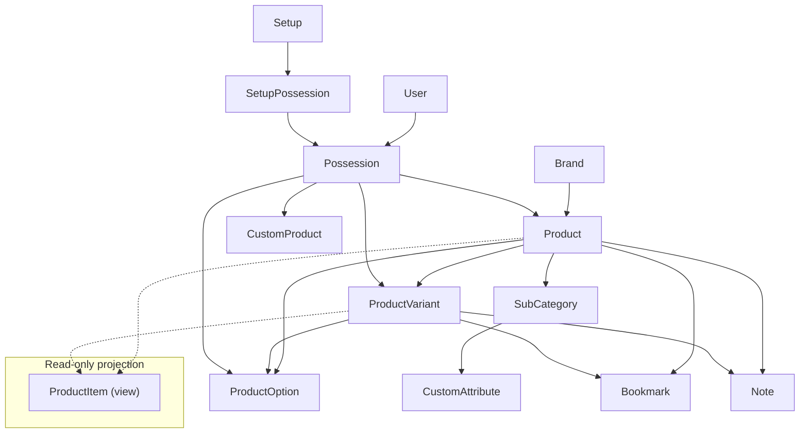

# HiFi Log

## Conceptual overview

The catalog is built around **brands** and **products**. A **product** is the canonical model for a piece of gear (name, brand, categories, base specs). A **product variant** is a distinct line under that product (different finish, revision, regional model, etc.) that can override some fields while still inheriting the rest from the parent product via delegation.

**Possessions** represent a user’s relationship to something in the catalog (or to a user-defined **custom product**): ownership, photos, purchase details, and optional links into **setups**. They always point at real database rows (`products`, `product_variants`, or `custom_products`), not at the unified listing abstraction.

**Product items** are not a third kind of catalog entity. They are a **read-only database view** that flattens each product and each of its variants into one row each, so lists, search, and filters can treat “a row in the catalog” uniformly while still knowing whether that row is the base product or a variant.

## Product

- **Belongs to** `Brand`.
- **Has many** `ProductVariant`, `ProductOption`, `Possession`, `Note`, `Bookmark` (as polymorphic `item`).
- **Has and belongs to many** `SubCategory` (with `Category` above that in the taxonomy).

The product holds the shared identity: brand, base name, URL slug for the product page, categorization, and shared metadata. Options that apply at the product level are stored as `ProductOption` rows tied to `product_id`.

## Product variant

- **Belongs to** `Product`.
- **Has many** `ProductOption`, `Possession`, `Note` (variants do not carry their own bookmarks in the same way as products in every flow, but bookmarks can target `ProductVariant` directly where the UI allows it).

Variants reuse a lot of behavior from the parent product (`delegate_missing_to :product`), so missing attributes fall through to the product. Variant-specific columns (name, slug scoped under the product, release/discontinued dates, price, model number, etc.) override or supplement that base. Each variant has its own URL under the parent product.

Uniqueness of variant identity is enforced in the model (name scoped with product, model number, and release components).

## Product option

`ProductOption` is a structured attribute line (e.g. color, impedance) that belongs to **either** a product **or** a variant, never both in one row:

- `product_id` set → option for the base product.
- `product_variant_id` set → option for that variant.

Possessions can optionally reference a `ProductOption` (for example to record which factory option the user actually has).

## Custom attributes (schema vs stored values)

The app separates **attribute definitions** from **per-product values**.

### `CustomAttribute` (definition)

- **Has and belongs to many** `SubCategory` (join `custom_attributes_sub_categories`). That ties each definition to the parts of the taxonomy where it applies (e.g. “amplifier channel type” only on relevant subcategories).
- Each row is a **reusable field definition**: unique `label`, `input_type` (`number`, `option`, `options`, `boolean`), optional `options` (JSON for choice labels/values), optional `units` and `inputs` arrays (validated against fixed allowlists), and a `highlighted` flag for UI emphasis.
- Definitions are **cached** (`CustomAttribute.all_cached`) and the cache is cleared on commit when a definition changes.

### Stored values on `Product`

- Actual answers live in `products.custom_attributes`, a **JSONB** column exposed through `store_accessor :custom_attributes`.
- Keys in that hash are **`CustomAttribute#label` values** (stable string identifiers such as `amplifier_channel_type`). Values hold the chosen option id, numeric payload, boolean, etc., depending on `input_type` and how forms submit (see `ProductsController` strong params and `convert_custom_attributes!`).
- List partials match rows by resolving **`CustomAttribute.all_cached`** with `ca.label == key` (see `shared/_product_item`).
- **`Product#custom_attributes_list`** walks the hash and resolves definitions from the product’s **subcategories**’ `custom_attributes` to build a single display string via I18n and each definition’s `options` map.
- **`Product#custom_attributes_resources`** loads `CustomAttribute` rows with `where(label: custom_attributes&.keys)` for helpers that need the full definition records.

### Variants and listings

- **Variants do not have their own `custom_attributes` column.** The `product_items` view exposes the parent **product’s** `custom_attributes` for both base-product rows and variant rows, so list UIs show the same structured metadata for the whole product family.

### Filtering and forms

- Category/brand/product index flows load the relevant **`CustomAttribute` records** for the current category or subcategory and build Ransack/filter params (e.g. `ProductFilterService`, `ProductItemsController`, `BrandsController`).
- **`CustomProduct`** does not use this system: it implements `custom_attributes` as an **empty hash** so it stays outside the catalog’s structured-attribute machinery.

## Product item (view + `ProductItem` model)

`product_items` is a SQL **UNION** of:

1. One row per **product** (`item_type = 'Product'`), with `product_id` set and `product_variant_id` null.
2. One row per **product variant** (`item_type = 'ProductVariant'`), with both `product_id` and `product_variant_id` set.

Each row gets a **stable UUID** derived from the underlying product or variant id, so the view has a primary key usable for APIs and forms, but **possessions and foreign keys in the rest of the schema still use `products.id` and `product_variants.id`**, not that UUID.

The `ProductItem` ActiveRecord model is `readonly?` and adds logic that does not live in SQL:

- Resolving which **possessions** matter for list thumbnails (base rows use **base-product** possessions only: `product_id` set and `product_variant_id` null; variant rows use that variant’s possessions).
- Preloading possession images for list performance.
- Search integration across the flattened columns (name, variant name, model number, brand name).

Use **Product** / **ProductVariant** when you create, update, or link records. Use **ProductItem** when you need a single query shape for “everything we list as one product line in the catalog.”

## Possession

A possession is a **user-owned instance** of catalog (or custom) gear:

- **Belongs to** `User`.
- **Optionally belongs to** `Product`, `ProductVariant`, `CustomProduct`, and `ProductOption`.

Typically a possession references either a product, a variant, or a custom product; the optional `ProductOption` narrows the configuration. Images and highlighted-image metadata attach to the possession, not to the product row. The **product** detail gallery and **base-product** list thumbnails only use possessions with `product_variant_id` null (even if the same user also has variant-specific possessions with both ids set); **variant** pages and list rows use that variant’s possessions.

**Setup** is modeled by `Setup` → `SetupPossession` → `Possession`: many possessions can appear in one named setup.

## Custom product

`CustomProduct` is a **parallel track** for user-defined gear that is not in the shared catalog. It belongs to a user, has categories, images, and a **single** linked `Possession` (enforced by uniqueness on `custom_product_id` on possessions). It does not participate in `Product` / `ProductVariant` / `ProductItem`.

## Bookmark

`Bookmark` is polymorphic: `item` may be a `Product`, `ProductVariant`, `Brand`, or `Event`, depending on what the user saved. It is not a possession; it is a lightweight saved reference for the user.

## Notes

`Note` attaches discussion text to a **product** and optionally to a **product variant** in a way constrained by validations (product required; variant uniqueness per user/product in the model).

## Search results

`SearchResult` is another read-only view (similar in spirit to `product_items`) used to expose a unified search row shape for products and variants with slugs and names for links. It complements `ProductItem` but is tuned for search payloads rather than full list rows.

---

## Presenters: what they wrap and why

Presenters sit **next to** ActiveRecord models. They format values, pick URLs, and centralize view-facing rules so templates and controllers stay thin.

### `ItemPresenter`

Base presenter for objects that have an optional `product` and `product_variant` (the typical case is **`Possession`**). It resolves **display name**, **model number** (variant overrides product), **paths** to product vs variant edit/show routes, and shared product fields (brand, categories). Specialized presenters subclass it.

### `PossessionPresenter` (`< ItemPresenter`)

Adds possession-specific behavior: purchase/sale prices, ownership period copy, **sorted and highlighted images** for galleries, and REST paths for updating or deleting the possession.

### `ProductItemPresenter`

Wraps a **`ProductItem`** (view row), not a raw `Product` or `ProductVariant`. It:

- Builds the correct **show path** (product vs nested variant route) from slugs on the view row.
- Formats release and discontinued dates from the flattened columns.
- Exposes **list imagery** from the same possession sets as above (no variant photos on the base-product list row), respecting profile visibility and delegating **highlighted image** choice to `PossessionPresenter`.

So: catalog list rows use `ProductItem` + `ProductItemPresenter`; a user’s gear list entry that is backed by a real possession uses `Possession` + `PossessionPresenter` (and thus `ItemPresenter`).

### `BookmarkPresenter`

Wraps a **`Bookmark`** and branches on `item_type` to load `Product`, `ProductVariant`, `Brand`, or `Event`, then exposes a unified **display name**, **discontinued** semantics, and delete path for the bookmark row.

### `CustomProductPresenter`

Wraps **`CustomProduct`** with an API shaped similarly to `ItemPresenter` / `PossessionPresenter` where the UI needs the same partials (names, paths, images, highlighted image), but without catalog product/variant ids.

### Other presenters

`SetupPossessionPresenter`, `PossessionPresenter`, `PreviousPossessionPresenter`, and `CustomProduct*PossessionPresenter` adapt possessions (or setup membership) for specific UI contexts (e.g. setup builder, timelines). `ImagePresenter` focuses on attachment presentation where reused.

---

## Quick reference

| Concept           | Mutable?  | Typical use                                                             |
| ----------------- | --------- | ----------------------------------------------------------------------- |
| `Product`         | Yes       | Admin/catalog identity, product page, HABTM categories                  |
| `ProductVariant`  | Yes       | Variant page, overrides under a product                                 |
| `ProductItem`     | No (view) | Unified product index, filters, list thumbnails                         |
| `Possession`      | Yes       | User owns gear, photos, setups, optional option                         |
| `CustomProduct`   | Yes       | User-defined gear + one linked possession                               |
| `Bookmark`        | Yes       | Saved pointer to product/variant/brand/event                            |
| `ProductOption`   | Yes       | Spec lines on product or variant                                        |
| `CustomAttribute` | Yes       | Field definitions per subcategory; product values in JSONB on `Product` |
