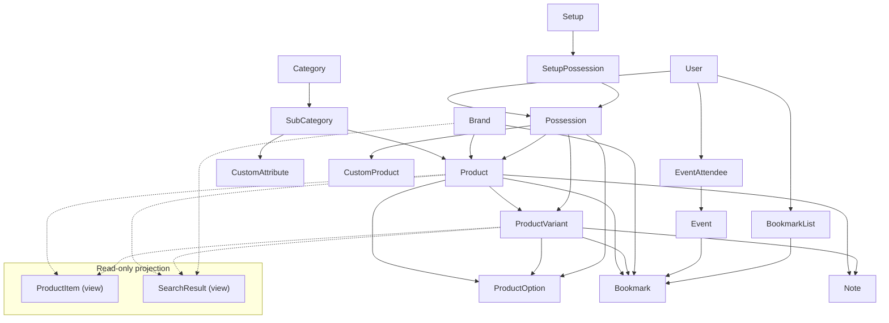

# HiFi Log

Architecture reference for the domain model, read-only SQL projections, and how the main concepts relate. Not a setup or operations guide.

## Conceptual overview

The catalog is built around **brands** and **products**. A **product** is the canonical model for a piece of gear (name, brand, categories, base specs). A **product variant** is a distinct line under that product (different finish, revision, regional model, etc.) that can override some fields while still inheriting the rest from the parent product via delegation.

**Possessions** represent a user’s relationship to something in the catalog (or to a user-defined **custom product**): ownership, photos, purchase details, and optional links into **setups**. They always point at real database rows (`products`, `product_variants`, or `custom_products`), not at the unified listing abstraction.

**Product items** are not a third kind of catalog entity. They are a **read-only database view** that flattens each product and each of its variants into one row each, so lists and filters can treat “a row in the catalog” uniformly while still knowing whether that row is the base product or a variant.

## Taxonomy

**`Category`** and **`SubCategory`** form the gear taxonomy. Products, brands, and custom products link to subcategories (HABTM). **`CustomAttribute`** definitions are also scoped to subcategories so structured fields only apply where relevant. Category trees are cached for navigation.

## Brand

**`Brand`** is the manufacturer or label (identity, country, lifecycle dates, description, optional logo). Brands link to subcategories and have many products. Catalog edits are versioned (see [Auditing](#auditing)).

## Product

- **Belongs to** `Brand`.
- **Has many** `ProductVariant`, `ProductOption`, `Possession`, `Note`, `Bookmark` (as polymorphic `item`).
- **Has and belongs to many** `SubCategory`.

The product holds shared identity: brand, name, slug, categorization, and shared metadata. Options at the product level are `ProductOption` rows on `product_id`.

## Product variant

- **Belongs to** `Product`.
- **Has many** `ProductOption`, `Possession`, `Note`.

Variants delegate missing attributes to the parent (`delegate_missing_to :product`). Variant-specific fields override or extend the base. Bookmarks may reference a variant as polymorphic `item` even though the variant model does not declare `has_many :bookmarks`.

## Catalog detail pages

**Product** and **ProductVariant** show pages share one orchestration path. For either entry type, the app loads:

- A **community image gallery** from possessions owned by users whose profiles allow catalog imagery (public always; logged-in-only when the viewer is signed in). Base-product pages use possessions with no variant; variant pages use that variant’s possessions.
- **Contributors** from version history on the parent product.
- **Custom attributes** from the product (variants surface the parent’s attribute set).
- When the viewer is signed in: their **possessions**, **bookmark**, **note**, and **setups** scoped to that product or variant.

**`ProductCatalogShowService`** assembles this context for both show pages.

## Product option

`ProductOption` belongs to **either** a product **or** a variant (never both): structured spec lines (e.g. color, impedance). Possessions may optionally reference one to record the configuration the user actually has.

## Custom attributes (definitions vs values)

**Definitions** (`CustomAttribute`) are reusable fields tied to subcategories: label, input type, options JSON, units, highlighted flag. Definitions are cached globally.

**Values** live in `products.custom_attributes` (JSONB); keys are attribute labels. Variants do not store their own values—the `product_items` view exposes the parent product’s hash for variant rows too.

**`CustomProduct`** opts out by returning an empty `custom_attributes` hash.

Filtering on catalog indexes uses the definitions applicable to the current category context.

## Product item (view)

`product_items` unions one row per product and one row per variant (`item_type` distinguishes them). Each row has a stable UUID for the view’s primary key; **foreign keys elsewhere still use `products.id` and `product_variants.id`**.

The `ProductItem` model is read-only and encodes list behavior: which possessions supply thumbnails (base-product rows ignore variant-linked possessions), image preloading, and catalog-scoped search on flattened columns.

Use **Product** / **ProductVariant** to mutate data; use **ProductItem** for unified catalog listing and filters.

## Possession

A **user-owned instance** of catalog or custom gear, optionally tied to a `ProductOption`. Images attach to the possession. Product pages and base-product list thumbnails use possessions with no `product_variant_id`; variant surfaces use that variant’s possessions.

**Setups** group possessions: `Setup` → `SetupPossession` → `Possession`. Setups are per-user, named, and may be **private** (affects public visibility and activity feed).

### Current vs previous collection

**`prev_owned`** separates the active collection from previous gear. **`period_from`** / **`period_to`** describe ownership spans; **`moved_to_previous_at`** records when an item left the current collection. Ownership changes drive corresponding **user activity** verbs.

## Custom product

User-defined gear outside the shared catalog: categories, images, and exactly one linked **possession**. Does not use `Product`, `ProductVariant`, or `ProductItem`.

## Bookmark

Polymorphic saved reference (`Product`, `ProductVariant`, `Brand`, or `Event`)—not ownership. **`BookmarkList`** optionally groups bookmarks per user.

## Event

Dated occurrences with RSVPs via **`EventAttendee`**. Bookmarkable; included in global search projection for products/brands only, not events.

## Notes

Discussion text on a **product**, optionally scoped to a **variant** (one note per user per product/variant combination).

## Users, profiles, and dashboard

**`User`** accounts hold the collection, setups, bookmarks, notes, RSVPs, and profile media (avatar, decorative image).

**Profile visibility** (`hidden`, `logged_in_only`, `visible`) controls public discoverability and whether collection imagery from that user appears on catalog pages.

- **Public profile**: overview (collection preview, statistics, upcoming events, activity feed), full collection, previous gear, history, contributions.
- **Dashboard**: the signed-in owner’s workspace—same domains plus account settings and a dedicated activity view.

## Authentication and admin

**Users** authenticate for the site (registration, confirmation, lockout). **Admin users** are a separate scope for back-office catalog management (ActiveAdmin). Community members can create and edit catalog entities; admins operate the full admin interface.

## Privacy policy

Published policy text has a **version** (requires re-acceptance) and a **content revision** (text-only updates). Users store which version they accepted and when. Sign-up requires acceptance; users on an outdated version must accept again or delete their account before using the app. Static/legal pages and account recovery remain available during that gate.

## User activity

Persisted **`UserActivity`** rows: **verb**, **occurred_at**, polymorphic **subject**, JSON **metadata** for display snapshots.

**Write path:** model callbacks → **`UserActivities::Recorder`** (possession sync via **`PossessionSync`** for ownership verbs).

**Read path:** **`UserActivityTimeline`** → feed rows on public overview and owner dashboard.

### Verbs and sources

| Source                   | Verbs (summary)                                                               |
| ------------------------ | ----------------------------------------------------------------------------- |
| `Possession`             | Collection/previous/moved; image upload/delete (image verbs hidden from feed) |
| `CustomProduct`          | `custom_product_created` (may suppress duplicate collection line)             |
| `Setup`                  | Created; public/private toggle (private toggle hidden from feed)              |
| `SetupPossession`        | Product added/removed from setup (private setups omitted from feed)           |
| `EventAttendee` / cancel | Attendance and cancellation                                                   |
| `User`                   | Avatar and decorative image changes (hidden from feed)                        |

Full verb list: `added_to_collection`, `added_to_previous`, `moved_to_previous`, `event_attendance`, `event_attendance_cancelled`, `setup_created`, `setup_made_public`, `setup_made_private`, `setup_product_added`, `setup_product_removed`, `custom_product_created`, `possession_image_uploaded`, `possession_image_deleted`, `avatar_uploaded`, `avatar_deleted`, `decorative_image_uploaded`, `decorative_image_deleted`.

**`hidden_at`** soft-hides rows. Some verbs are stored for auditing but excluded from the public feed (`FEED_HIDDEN_VERBS`).

### Timeline rules

- Order by `occurred_at`, not display dates in metadata.
- Respect setup visibility (public setups only; special case for setups deleted after being public).
- Hide redundant private `setup_created` when a later public toggle exists.
- Group contiguous similar items; dedupe consecutive duplicates.

A **backfill** task can rebuild activities from existing possessions, setups, RSVPs, and attachments where historical data allows.

## Search

**`SearchResult`** is a read-only view unioning products, variants, and brands with a unified name/slug shape for global search. **`ProductItem`** powers catalog browsing and category filters—separate concern from site-wide search.

## Auditing

**PaperTrail** versions **products**, **variants**, and **brands**. Per-record changelogs and a contributions summary show who edited the catalog over time.

## Cross-cutting concerns

**Service objects** orchestrate catalog filtering, catalog detail (product/variant show) pages, statistics, caching of taxonomy/counts, possession→presenter selection, newsletter unsubscribe, and activity recording/backfill.

**Caching** covers taxonomy menus, entity counts, custom attribute definitions, event counts, and some rendered legal or policy content.

**Attachments** (Active Storage): possession and custom-product image galleries; user avatar and decorative banner; brand logos. Purges on possessions and profile images can emit activity rows.

**App news** announcements can be dismissed per user (HABTM).

**Statistics** aggregate a user’s possessions (current vs previous, costs, duration, categories) for dashboard and profile summaries.

**Security:** rate limits on auth and catalog writes; content security policy; bot challenge on registration and password reset.

## Presenters

Presenters sit beside models and centralize display rules for templates.

| Presenter                                                               | Wraps                                                                |
| ----------------------------------------------------------------------- | -------------------------------------------------------------------- |
| **`ItemPresenter`**                                                     | Base for gear with optional product/variant (usually via possession) |
| **`PossessionPresenter`**                                               | Current possession: prices, periods, gallery                         |
| **`PreviousPossessionPresenter`**                                       | Previous-collection possession                                       |
| **`ProductItemPresenter`**                                              | Catalog list row (paths, dates, list thumbnails)                     |
| **`BookmarkPresenter`**                                                 | Polymorphic bookmark target                                          |
| **`CustomProductPresenter`**                                            | Custom product with possession-like UI                               |
| **`SetupPossessionPresenter`**, **`CustomProduct*PossessionPresenter`** | Setup builder and related contexts                                   |
| **`ImagePresenter`**                                                    | Shared attachment presentation                                       |

**`PossessionPresenterService`** chooses among possession presenters by ownership state and custom-product linkage.

---

## Quick reference

| Concept                     | Mutable?  | Role                                                  |
| --------------------------- | --------- | ----------------------------------------------------- |
| `Category` / `SubCategory`  | Yes       | Taxonomy; scopes catalog and custom attributes        |
| `Brand`                     | Yes       | Manufacturer; products; bookmarks; search             |
| `Product`                   | Yes       | Shared catalog identity                               |
| `ProductVariant`            | Yes       | Variant-specific overrides                            |
| `ProductItem`               | No (view) | Unified catalog rows                                  |
| `SearchResult`              | No (view) | Global search rows                                    |
| `Possession`                | Yes       | Ownership, photos, setups; current vs previous        |
| `Setup`                     | Yes       | Named public/private gear groupings                   |
| `CustomProduct`             | Yes       | Off-catalog user gear                                 |
| `Bookmark` / `BookmarkList` | Yes       | Saved references; optional lists                      |
| `Event` / `EventAttendee`   | Yes       | Occurrences and RSVPs                                 |
| `ProductOption`             | Yes       | Spec lines on product or variant                      |
| `CustomAttribute`           | Yes       | Field definitions; values on `Product`                |
| `UserActivity`              | Yes       | Social/history feed                                   |
| `User`                      | Yes       | Account, visibility, policy acceptance, profile media |
