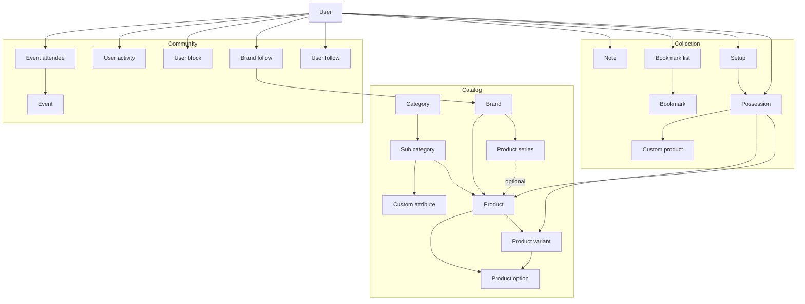

# HiFi Log

HiFi Log is a community database for home hi-fi products and brands. It includes current and
discontinued brands, and vintage and modern gear. It does not include studio or PA gear.

The application has two functions:

- It helps users find products and brands.
- It helps users record their own gear, with costs, statistics, bookmarks and notes.

This document gives a short overview of the architecture and the terms. The technical details are
in [`docs/`](docs/).

## System at a glance

- **Stack:** Ruby on Rails, PostgreSQL, hosted on Heroku, with Cloudflare as CDN for static assets.
- **One web application.** The server renders the pages. Plain JavaScript adds small functions on
  the client.
- **One relational database.** Read-only database views combine data for lists, search and feeds.
  Thus, lists and filters can use one row type for products and product variants.
- **Background jobs** run in the web process. There is no separate worker process.
- **Admin back office.** Admins sign in separately and manage the catalog, the categories and the
  newsletter.
- **Performance has high priority.** The catalog grows. Expensive results are cached or calculated
  in the background.

## Terms

Most terms are the names of the models in the code. The other terms are the names of features.

### Catalog

| Term                 | Meaning                                                                                                                      |
| -------------------- | ---------------------------------------------------------------------------------------------------------------------------- |
| **Brand**            | The name under which products are sold. HiFi Log uses "brand", not "manufacturer".                                           |
| **Category**         | A top-level group of gear, for example Amplifiers.                                                                           |
| **Sub category**     | A group in a category, for example Integrated Amplifiers. Products and brands can be in many sub categories.                 |
| **Product**          | A model of gear from one brand.                                                                                              |
| **Product series**   | An optional named product line of one brand, for example "Heritage". A product has zero or one product series.               |
| **Product variant**  | A smaller edition of a product under the same name: a finish, a limited edition, a regional model number.                    |
| **Product option**   | A configuration in which a product or product variant is sold, for example a colour or a cable length.                       |
| **Custom attribute** | A field for a value that is true for each unit of a product, for example weight or impedance. Defined for each sub category. |
| **Product item**     | One row in the catalog lists: a product or a product variant. The lists show the two together.                               |
| **Search result**    | One row in the global search: a product, product variant, brand or product series.                                           |
| **Similar products** | Products that can replace a product, for example another turntable.                                                          |
| **Related products** | Products that connect to a product, for example a phono stage for a turntable.                                               |

### Collection

| Term               | Meaning                                                                                                                                |
| ------------------ | -------------------------------------------------------------------------------------------------------------------------------------- |
| **Possession**     | An item of gear that a user owns (current) or owned (previously owned). It refers to a product, a product variant or a custom product. |
| **Custom product** | Gear that a user adds for their own collection only. It is not part of the catalog.                                                    |
| **Setup**          | A named group of possessions, for example a living room system. A setup can be private.                                                |
| **Bookmark**       | A saved reference to a product, product variant, brand or event.                                                                       |
| **Bookmark list**  | A named group of bookmarks.                                                                                                            |
| **Note**           | A private text of a user on a product or product variant.                                                                              |
| **Statistics**     | Figures about the collection of a user, for example costs and ownership duration. The UI calls them "Insights".                        |

### Community

| Term                   | Meaning                                                                                                  |
| ---------------------- | -------------------------------------------------------------------------------------------------------- |
| **User**               | A person with an account on the site.                                                                    |
| **Admin user**         | A person with an account for the admin back office. Separate from users.                                 |
| **Profile visibility** | Who can see a profile: everybody, signed-in users only, or nobody.                                       |
| **Dashboard**          | The private start page of a signed-in user.                                                              |
| **User follow**        | A user follows another user.                                                                             |
| **Brand follow**       | A user follows a brand and sees its new products and product variants.                                   |
| **User block**         | A user blocks another user. This removes the user follows between the two users.                         |
| **User activity**      | An action of a user, for example a new possession. The feed shows the user activities of followed users. |
| **Event**              | A dated hi-fi event.                                                                                     |
| **Event attendee**     | A user who attends an event.                                                                             |

### Contribute

| Term             | Meaning                                                                                                     |
| ---------------- | ----------------------------------------------------------------------------------------------------------- |
| **Contribute**   | The section with lists of brands and products that do not have a specific value, as tasks for contributors. |
| **Guidelines**   | The rules for contributors, on one public page in the Contribute section.                                   |
| **Completeness** | How complete the data of a brand, product or product variant is, from 0 to 100.                             |
| **Version**      | A record of one change to a brand, product, product variant or product series. Gives the changelog.         |

## How the parts relate

```mermaid
flowchart TB
  subgraph Catalog
    Category --> SubCategory[Sub category]
    Brand --> ProductSeries[Product series]
    Brand --> Product
    SubCategory --> Product
    SubCategory --> CustomAttribute[Custom attribute]
    ProductSeries -.->|optional| Product
    Product --> ProductVariant[Product variant]
    Product --> ProductOption[Product option]
    ProductVariant --> ProductOption
  end
  subgraph Collection
    Possession
    CustomProduct[Custom product]
    Setup
    Bookmark
    BookmarkList[Bookmark list]
    Note
  end
  subgraph Community
    UserFollow[User follow]
    BrandFollow[Brand follow]
    UserBlock[User block]
    UserActivity[User activity]
    EventAttendee[Event attendee] --> Event
  end
  User --> Possession
  User --> Setup
  User --> BookmarkList --> Bookmark
  User --> Note
  User --> UserFollow
  User --> BrandFollow --> Brand
  User --> UserBlock
  User --> UserActivity
  User --> EventAttendee
  Possession --> Product
  Possession --> ProductVariant
  Possession --> CustomProduct
  Setup --> Possession
```

## Main areas

The application has five areas. The home page shows the first three as "Discover", "Collect" and
"Contribute".

### Catalog

The catalog is public. It contains brands, product series, products, product variants and product
options, in categories and sub categories. Admin users define the custom attributes for each sub
category. The values of the custom attributes are on the product.

Two rules keep the data consistent:

- **Different custom attribute values mean a different product.** A product variant can have a
  different finish or model number, but it always has the custom attribute values of its product.
  A Mk II is a new product.
- **A custom attribute describes each unit. A product option describes a configuration for sale.**
  The conductor material of a cable is a custom attribute. Its length is a product option.

Users find products and brands through the global search, the filters on the list pages, the brand
and product series pages, and the similar products and related products on the product pages.

### Collection

A signed-in user records their gear as possessions. A possession refers to a product, a product
variant or a custom product. It has photos, purchase details and ownership dates. When the user
sells an item, the possession becomes previously owned. Users group possessions in setups, and save
bookmarks and notes. The statistics show figures about the collection.

Photos of possessions also show on the catalog pages, but only when the profile visibility of the
owner allows it.

### Community

Each user has a profile. The profile visibility controls who can see the profile and the photos of
the user. Users can follow other users and brands, and can block users. The dashboard shows the
user activities of followed users, and the new products and product variants of followed brands.
Users can get emails for new followers and a newsletter.

### Contribute

Each signed-in user can add and edit brands, product series, products and product variants. Each
change makes a version. Thus, each of these records has a changelog and a list of contributors.

Most records are incomplete. This is normal. The completeness shows what is missing. The Contribute
section lists brands and products with one missing value, and shows the most complete records
first. The guidelines give the rules for contributors.

### Admin

Admin users use a separate back office. They manage the categories, sub categories and custom
attributes, delete records, write the newsletter, and review product data from brand websites
before it goes into the catalog.

## Documentation

| Topic                                                           | Document                                                            |
| --------------------------------------------------------------- | ------------------------------------------------------------------- |
| Categories, brands, products, product variants, product options | [catalog-model.md](docs/catalog-model.md)                           |
| Product series                                                  | [product-series.md](docs/product-series.md)                         |
| Custom attributes                                               | [custom-attributes.md](docs/custom-attributes.md)                   |
| Catalog lists, filters and search                               | [catalog-listing-and-search.md](docs/catalog-listing-and-search.md) |
| Similar Products and Similar Brands                             | [similar-products.md](docs/similar-products.md)                     |
| Related Products                                                | [related-products.md](docs/related-products.md)                     |
| Related Products: pairing graph (authoring source)              | [pairing-graph.md](docs/pairing-graph.md)                           |
| Possessions, setups, bookmarks, notes, statistics               | [collection.md](docs/collection.md)                                 |
| Users, profiles, events, following and blocking                 | [users-and-social.md](docs/users-and-social.md)                     |
| Following brands                                                | [brand-follows.md](docs/brand-follows.md)                           |
| User activity                                                   | [user-activity.md](docs/user-activity.md)                           |
| Completeness and the Contribute section                         | [completeness.md](docs/completeness.md)                             |
| Guidelines for contributors                                     | [contribution-guidelines.md](docs/contribution-guidelines.md)       |
| Home page                                                       | [home-page.md](docs/home-page.md)                                   |
| Bulk import from brand websites                                 | [import.md](docs/import.md)                                         |
| Authentication, privacy policy and security                     | [privacy-auth-security.md](docs/privacy-auth-security.md)           |
| Services, controller concerns, presenters, caching              | [code-structure.md](docs/code-structure.md)                         |
| Background jobs                                                 | [background-jobs.md](docs/background-jobs.md)                       |
