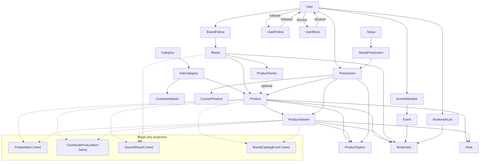

# HiFi Log

Architecture reference for the domain model, read-only SQL projections, and how the main concepts relate. Not a setup or operations guide.

## Conceptual overview

The catalog is built around **brands** and **products**. A **product** is the canonical model for a piece of gear (name, brand, categories, base specs). A **product variant** is a smaller edition of that product under the same name (a special finish, a limited run, a regional model) that can override some fields while still inheriting the rest from the parent product. **A version whose specifications differ is a separate product, not a variant** — see [Product variant](#product-variant).

**Possessions** represent a user's relationship to something in the catalog (or to a user-defined **custom product**): ownership, photos, purchase details, and optional links into **setups**. They always point at real database rows (`products`, `product_variants`, or `custom_products`), not at the unified listing abstraction.

**Product items** are not a third kind of catalog entity. They are a **read-only database view** that flattens each product and each of its variants into one row each, so lists and filters can treat "a row in the catalog" uniformly while still knowing whether that row is the base product or a variant. A second view of the same shape, **contribute product items**, adds the completeness information the contribution queues sort and filter on.


```mermaid
flowchart TB
  Category --> SubCategory
  SubCategory --> Product
  SubCategory --> CustomAttribute
  Brand --> Product
  Brand --> ProductSeries
  ProductSeries -.->|optional| Product
  Product --> ProductVariant
  Product --> ProductOption
  ProductVariant --> ProductOption
  User --> Possession
  Possession --> Product
  Possession --> ProductVariant
  Possession --> CustomProduct
  Possession --> ProductOption
  Product --> Bookmark
  ProductVariant --> Bookmark
  Brand --> Bookmark
  Event --> Bookmark
  User --> BookmarkList
  BookmarkList --> Bookmark
  Setup --> SetupPossession --> Possession
  Product --> Note
  ProductVariant --> Note
  User --> EventAttendee --> Event
  User -->|follower| UserFollow -->|followed| User
  User -->|blocker| UserBlock -->|blocked| User
  User --> BrandFollow --> Brand
  subgraph readonly [Read-only projection]
    ProductItem["ProductItem (view)"]
    ContributeProductItem["ContributeProductItem (view)"]
    SearchResult["SearchResult (view)"]
    BrandCatalogEvent["BrandCatalogEvent (view)"]
  end
  Product -.-> ProductItem
  ProductVariant -.-> ProductItem
  Product -.-> ContributeProductItem
  ProductVariant -.-> ContributeProductItem
  Product -.-> SearchResult
  ProductVariant -.-> SearchResult
  Brand -.-> SearchResult
  Product -.-> BrandCatalogEvent
  ProductVariant -.-> BrandCatalogEvent
```

## Taxonomy

**`Category`** and **`SubCategory`** form the gear taxonomy. A sub category carries both a
**`slug`** and an **`identifier`**: the slug is derived from `name` and FriendlyId regenerates it
whenever the name changes, which is right for a URL and wrong for a reference. `identifier` is
derived from the name once, on create, and then refuses to change — it is what
[Related Products](#related-products) points at, so a display rename cannot silently empty a
pairing edge. Products, brands, and custom products each link to many subcategories. **`CustomAttribute`** definitions are also scoped to subcategories so structured fields only apply where relevant. Category trees are cached for navigation.

## Brand

**`Brand`** is the manufacturer or label (identity, country, lifecycle dates, description, optional logo). Brands link to subcategories and have many products. Catalog edits are versioned (see [Auditing](#auditing)).

Brands can also be **followed** — see [Following brands](#following-brands).

A brand carries three names, each with one job:

- **`name`** — canonical identity, written the way the manufacturer writes it ("Bang & Olufsen"). Unique, and the `friendly_id` slug source. Used for JSON-LD `name` and wherever the brand has to be identified unambiguously.
- **`abbreviation`** — optional short form the brand is known by that is **not** part of its name: "B&O" for "Bang & Olufsen". A `before_validation` clears anything already contained in `name`, so whatever survives is never already visible beside it and display sites need no repetition check. Catalog views expose it as `brand_abbreviation` so listings don't join.
- **`legal_name`** — optional registered company name ("Bang & Olufsen A/S"). Shown in the facts list on the brand page and filterable, but excluded from ranked search.

Two accessors decide which form is rendered where:

- **`Brand#display_name`** — `abbreviation` if there is one, otherwise `name`. This is the default. It is what product and variant titles use, what product slugs are built from, and what lists, breadcrumbs and nav links show wherever there is room for only one string.
- **`Brand#seo_name`** — `"B&O (Bang & Olufsen)"` when an abbreviation exists, otherwise `name`. Used for the brand page title; the brand page `<h1>` renders the same pair as markup rather than a string.

Where there is room for both — brands index rows, brand search results, the sitemap — the abbreviation has priority, followed by `name`.

Product titles and slugs are built from `Brand#display_name`, and nothing on `Product` notices a change to either brand column. So `Brand` has an `after_update` calling `Product.resync_slugs_for` whenever `name` **or** `abbreviation` changes (`brand_naming_changed?`); it re-slugs the brand's products and preserves the old slugs in `friendly_id_slugs` so they 301. Adding an abbreviation to an existing brand therefore moves every product URL under it, which is intended: the title moves too.

## Product

A product belongs to one brand, has many variants, options, possessions, notes, and can be bookmarked. It links to many subcategories.

The product holds shared identity: brand, name, slug, categorization, and shared metadata. Options declared directly on the product represent product-level specs, as distinct from options declared on a specific variant.

## Product series

A **`ProductSeries`** is a named product line of one brand ("Klipsch Heritage", "Fezz
Evolution"). A product has zero or one series (`products.product_series_id`, nullable). A variant
has no series of its own: it uses the series of its product, in the same way as it uses the brand.
Series are flat (no parent series). The design and the decisions are in `docs/product-series.md`.

**The name is stored one time, on the series.** It is not part of `products.name` and not part of
the visible title:

- `Product#display_name` ("Fezz Audio Omega Lupi") is the `<h1>`, the JSON-LD name and the list title.
- `Product#qualified_name` ("Fezz Audio Omega Lupi (Evolution series)") is for plain text: the
  `<title>` element, ActiveAdmin, alt text. `ProductVariant#qualified_name` is the same for variants.
- `Product#url_slug` is brand + series + name + model no.: `fezz-audio-evolution-omega-lupi`.
- `ProductSeries#label` gives "Evolution series", or "800 Series" for a name that already ends
  with "series".

Two products with the same name are valid in two series; `name` + `model_no` is unique within
brand + series (a model validation, checked only when one of these values changes). A product
name must not start or end with the name of its series. The product page shows the series as a
linked line under the `<h1>`, as a row in the product data, and in a **"More from this series"**
block (`SeriesProducts`); list rows show the series name after the title (`product_items.series_name`).

**Slugs follow the series.** Setting, changing or removing the series of a product, and renaming a
series, re-slugs the products (`Product.resync_slugs`, the same path as a brand rename). The old
slug stays in `friendly_id_slugs`, so it answers with a 301.

**Derived values are not stored.** Years, discontinued status and categories of a series come from
its products: `ProductSeries#stats` is one grouped query over the products of the series.
`products_count` is a counter cache of base products.

**Pages and editing.** The series page is `/brands/:brand_id/series/:id` (`ProductSeriesController`;
"series" is uncountable, so the helpers are `brand_series_index_path` and `brand_series_path`). It
lists the products in release order with the brand products filter, and is `noindex` while the
series is empty. The brand page links the series of the brand and shows the newest products of
the brand (8) and of each series (4) (`BrandLatestProducts`; newest release first, then undated products by
the date they were added), and the brand products page can
filter by series (`?series=<slug>` or `?series=none`). Signed-in users create and edit series. The
edit page of a series also lists the products of the brand with a checkbox each (50 per page, with
a search); one submit saves the series and the checked products in one transaction
(`ProductSeriesAssignment`: the name clash is looked for in the end state, and a product that can
not change is reported and left as it is). A product also
gets its series in the product form, where one field selects an existing series or creates a new
one (`Product#product_series_name=`).
Only admins delete a series; the products keep existing without a series. Series are versioned with
PaperTrail. A series can not be followed or bookmarked: a user who follows the brand already gets
every new product of its series in the feed (see [Following brands](#following-brands)).

## Product variant

A variant belongs to one product and has its own options, possessions, and notes. Where a variant doesn't override a field, it falls back to the parent product's value. Variants can also be bookmarked directly, alongside products, brands, and events.

### A variant never has different specifications

This is the rule the custom attribute design rests on, so it is worth stating as a prohibition rather than a description. A variant is a **smaller edition under the same name** — a finish, a limited run, a regional model number. Anything whose measured behaviour differs, a Mk II or a second impedance, is **a separate product**.

Two consequences follow, and neither is a bug:

- `product_items` projects `products.custom_attributes` onto variant rows as well as product rows. That is correct by construction: a variant shares its parent's specs because it is not allowed to have others. Filtering by a spec therefore returns the product _and_ its variants, which is the right answer.
- Specs are excluded from a variant's completeness score, because there is nothing for a variant to fill in.

The rule is not enforced anywhere, and it fails quietly when broken: a variant added for a second impedance will display and be filtered under the parent's impedance, and nothing distinguishes that from a correct row. The contribution guidelines state the rule (`app/views/product_variants/_form.html.erb`); the catalogue does not check it.

Separating a Mk II into its own product also severs the link to what it replaced — there is no relationship between products today, so the two entries sit unrelated. That is the main pressure to bend the rule, and a lightweight succession link between products would relieve it without giving variants specs of their own.

## Catalog detail pages

**Product** and **ProductVariant** show pages share one orchestration path. For either entry type, the app loads:

- A **community image gallery** from possessions owned by users whose profiles allow catalog imagery (public always; logged-in-only when the viewer is signed in). Base-product pages use possessions with no variant; variant pages use that variant's possessions.
- **Contributors** from version history on the parent product.
- **Custom attributes** from the product (variants surface the parent's attribute set).
- **Similar products** and **related products** (see the two sections below).
- **More from this series**: the other products of the product's series (`SeriesProducts`, see [Product series](#product-series)).
- When the viewer is signed in: their **possession**, **bookmark**, **note**, and **setups** scoped to that product or variant.

**`ProductCatalogShowService`** assembles this context for both show pages.

The meta block at the end of the sidebar (completeness prompt, "Edit" and "Changelog" links,
contributors) is one partial, **`shared/_entity_meta`**, for the brand, product, variant and
product series pages. `ApplicationHelper#contributor_links` renders the contributors; a hidden
profile shows the name without a link.

## Similar Products

The **"Similar Products"** block on product and variant show pages lists products that fill the
same role as the entry: other products that a user can compare with it. It is shown above
"Related Products" and uses the same list layout. It shows `RelatedProducts::Query::PER_GROUP`
items, the same number as one group of "Related Products". When no candidate has the minimum
score, the block is not shown.

When there are more candidates than the block shows, a **"View all"** link opens the full list at
`/products/:product_id/similar` (`ProductsController#similar`). This page shows all candidates with
the minimum score, in the same order, with pagination (`SimilarProducts::PER_PAGE`, the Kaminari
default). It uses the layout of `brands#products` (`shared/index_page`): the sidebar on the left
shows the product (name, category, dates, price and characteristics), the content on the right
shows the list. The data list is the partial `products/_data`, which the product show page also
uses. On viewports narrower than 48rem, only the headline is shown: the product data
(`.IndexPage-details`) is hidden. The page is `noindex, follow`: its content is a list of other
catalogue pages.

A variant has its own page at `/products/:product_id/v/:id/similar`
(`ProductVariantsController#similar`). The list is the same as the list of the parent product,
because the ranking uses the attributes of the product. The sidebar shows the variant: its name,
dates and price, with the categories and characteristics of the product. Both pages render
`shared/_similar_products_page`.

"Similar" and "related" are different questions. A related product connects to the entry (a
phono stage for a turntable). A similar product replaces it (another turntable).

### Candidates

A candidate must have at least one sub category in common with the product. The product itself is
not a candidate. There are no other exclusions: the block does not remove products from the same
brand, the same product series, or the "Related Products" block. Candidates are base products only,
not variants.

A variant page shows the list of its parent product. Variants have no custom attributes of their
own, so a list for each variant would be almost the same list.

### Ranking

Candidates with exactly the same sub categories always come first. In each of these two groups,
the **score** sets the order. The score is the sum of these parts:

| Part                       | Points                                                                                              |
| -------------------------- | --------------------------------------------------------------------------------------------------- |
| **Sub category overlap**   | `100 * shared / all` (Jaccard index) of the sub categories of both products                         |
| **Categorical attributes** | `weight * shared / all` of the values of both products, for option, options and boolean attributes  |
| **Numeric classes**        | `weight` when both values are in the same class, for example output power < 25 W, 25–100 W, > 100 W |
| **Price band**             | 2 for the same band, 1 for the next band. Bands are approximately x3 wide. Same currency only.      |

When the scores are equal, these values set the order:

1. The same discontinued status as the product.
2. The smallest difference in release year. A missing year comes last.
3. The product id, so that the order is always the same.

A missing value on one side gives 0 points, not a penalty. Thus, a candidate with more data can
get more points. The brand does not change the score.

**`SimilarProducts::Weights`** holds all tuning values as Ruby constants: the weight of each
attribute label (3 = defines what the product is, 2 = important, 1 = small detail, not listed =
ignored), the numeric classes, the price band width and the minimum score. Dimensions, weight and
sensitivity are not used, because they are too specific to a single product. A test makes sure
that each label in the weights exists.

### Reading path

**`SimilarProducts.for`** gives the block, called from `ProductCatalogShowService`.
**`SimilarProducts.page`** gives one page of the full list as a Kaminari array.
**`SimilarProducts::Query`** calculates the score of all candidates in one SQL statement. It sends
back only the ids of the requested rows (`LIMIT` and `OFFSET`) and the number of all candidates
with the minimum score. The block uses this number to decide if it shows "View all":

- The index on `products_sub_categories.sub_category_id` finds the candidates. Thus, the work
  depends on the size of the sub categories of the product, not on the size of the catalogue.
- The values of the product are constants in the SQL. The query has one term for each attribute
  that the product has.
- Nested subqueries with `OFFSET 0` make sure that PostgreSQL calculates each attribute array one
  time per row.
- Price bands are compared with limits calculated in Ruby. `log()` on a numeric column is slow.
- The uuid of a `ProductItem` is calculated only for the rows in the result.
- The statement always returns one row, also for a page after the last one. Thus, the total is
  always known.

For reference: 5,000 candidates take approximately 60 ms, 30,000 candidates approximately 190 ms.
A later page costs the same as the first page, because all candidates are scored in each case.

The ranked ids and the total are **cached** for 24 hours, one entry for each page. The key contains
the product (`cache_key_with_version`), its sub category ids, the limit, the offset and
`SimilarProducts::CACHE_VERSION`. The records are loaded on each request,
so a changed name or image of a candidate shows immediately. A new or changed candidate gets into
an existing list when the cache entry expires. When you change the scoring, increase
`CACHE_VERSION`.

## Similar Brands

The **"Similar Brands"** block on the brand show page lists brands that make the same kind of
products. It works like [Similar Products](#similar-products): the same list layout, the same number
of items (`SimilarBrands::LIMIT`), a **"View all"** link when there are more candidates, and a full,
paginated list at `/brands/:brand_id/similar` (`BrandsController#similar`). That page has the brand
in the sidebar (the partial `brands/_data`, which the show page also uses), is `noindex, follow`, and
shows only the headline on viewports narrower than 48rem.

A brand has little data of its own, so most of the signal comes from its **products**. A candidate
must have at least one product in a sub category of the brand. Its profile uses only these
products: a turntable maker is compared on turntables, also when the candidate makes amplifiers
too.

### Ranking

The score is the sum of these parts. The weights are in **`SimilarBrands::Weights`**.

| Part                     | Points                                                                                                                                                              |
| ------------------------ | ------------------------------------------------------------------------------------------------------------------------------------------------------------------- |
| **Sub category profile** | `100 * Σ min(share of the brand, share of the candidate)` over the sub categories of the brand. A share is the part of all products of a brand in one sub category. |
| **Active period**        | `20 * shared years / all years`. A brand is active from its founded year to its discontinued year, or to this year. An unknown start or end gives 0.                |
| **Country**              | 15 for the same country                                                                                                                                             |
| **Price level**          | 10 for the same band of the median product price, 5 for the next band. Same bands as for products, same currency only.                                              |
| **Attributes**           | For each attribute in `SimilarProducts::Weights::ATTRIBUTES`: `weight * the part of the candidate's products with the most frequent value of the brand`             |

When the scores are equal, the same discontinued status comes first, then the brand with more
products, then the brand id. Candidates with less than `MIN_SCORE` (10) are not shown. The share
makes a specialist rank above a generalist: a brand with 1 turntable in 16 products gets only
6.25 points for a turntable maker.

### Reading path

**`SimilarBrands.for`** gives the block and **`SimilarBrands.page`** gives one page of the full list.
**`SimilarBrands::Query`** works in two steps:

1. Ruby reads the profile of the brand from its own products: the share in each sub category, the
   most frequent value of each weighted attribute, and the median price in its most frequent
   currency.
2. One SQL statement makes the same profile for all candidate brands, calculates the scores, and
   sends back only the ids of the requested rows and the number of all candidates.

The index on `products_sub_categories.sub_category_id` finds the products. The work depends on the
number of products in the sub categories of the brand. For reference, with 200,000 products: a
brand in one sub category takes approximately 70 ms, a brand in all sub categories approximately
700 ms (it reads the whole catalogue). The number of all products of a candidate is counted, not
read from `brands.products_count`, because that column also counts variants.

The ranked ids and the total are **cached** for 24 hours, one entry for each page. The key contains
the brand (`cache_key_with_version`), the limit, the offset and `SimilarBrands::CACHE_VERSION`. A
product change touches its brand (`belongs_to :brand, touch: true`), so a change of the brand's own
products makes a new key. A change of a candidate gets into existing lists when the entry expires.

**`SimilaritySql`** (`app/services/concerns`) holds the SQL parts that both queries use: attribute
values as JSON arrays, price bands and quoting.

## Related Products

The **"Related Products"** block on product and variant show pages lists companions an entry is
compatible with. It is a read-only projection over the existing catalogue — no new tables, no
migration — and its authoring source and rationale live in `docs/pairing-graph.md`.

Three stages, deliberately separate: **gate** (may this be shown at all), **score** (how good a
suggestion is it), **assemble** (what the block contains).

### The graph

**`RelatedProducts::Graph`** is hand-authored Ruby constants. A **role** groups sub categories
occupying the same position in a signal chain (`power_amp`, `headphone`, `cable_phono`); every sub
category has exactly one. **Edges are directed** — an edge on role A pointing at B means "B may
appear on A's page", and the reverse is a separate declaration, so a power cable belongs on an
amplifier page while an amplifier does not belong on a power cable page. **Declaration order is
priority.** Roles that only receive edges (cables, racks, isolation, power conditioning) declare
none of their own.

Roles are an authoring abstraction, not runtime data: nothing is stored, and the constants are
cached only insofar as sub category ids are (`CacheService.sub_category_ids_for`).

**Roles select; sub categories group.** A role pools candidates across all its sub categories,
but the group the reader sees is labelled and linked by the sub category its items are actually
in, and each role renders at most one group — the sub category holding its top-ranked candidate.
Roles name no browsable page: a heading built from `integrated` ("Integrated Amplifiers &
Receivers") could only link up to the whole Amplifiers category, promising phono stages and tuners
the group does not contain. Grouping by sub category means every heading is exactly what is listed
and links to a real index, at the cost of a role's other sub categories going unshown on that page.

### Gates

Edges may be conditional on custom attributes, in four shapes:

| Shape              | Meaning                                     | Example                                                                                                                    |
| ------------------ | ------------------------------------------- | -------------------------------------------------------------------------------------------------------------------------- |
| **source**         | the source product must hold a value        | power tubes appear on an amplifier only when `amplifier_type` is tube or hybrid                                            |
| **target**         | candidates are narrowed                     | a step-up transformer page lists only `cartridge_type = mc`                                                                |
| **cross match**    | source value must intersect candidate value | a cartridge appears on a phono stage only if its type is one that stage supports                                           |
| **specialisation** | the value changes _which_ edges exist       | a passive loudspeaker wants a power amp and speaker cable; an active one wants a preamp, an interconnect and a power cable |

Option values are declared as **i18n keys** and resolved to stored option ids at query time, so
renaming an option cannot break a gate. `ProductVariant` carries no attributes of its own, so on a
variant page every gate reads the parent product.

Two failure modes, deliberately different: an attribute that **applies but is unfilled** fails
**closed** — the edge does not render, because unfilled is not the same as known-not-to-match. An
attribute **never attached to that sub category** is **inapplicable** and passes ungated: the
question was never asked. This mirrors `Completeness`, where an inapplicable field leaves the
denominator rather than scoring as missing. A consequence worth stating plainly: gate attribute
coverage is currently low, so the block is absent on most pages, and those attributes are among
the highest-value contribution targets on the site.

A handful of edges ship **disabled** because no attribute can usefully express their gate.
Headphone, digital and speaker cables have no connector or termination attribute on either side.
Interconnects do have one, but at 0–1% coverage it closed the gate on every role the attributes
apply to while leaving them ungated on the one role they are not attached to — so those edges are
off until coverage is real. A third group (a DAC or streamer feeding a power amplifier or an active
loudspeaker) assumes volume control that nothing records. An ungated suggestion is not a softer
version of a gated one; it is advice to buy something that will not connect.

Because the graph is Ruby constants, nothing in the database can enforce its references, so the
models refuse the edits that would break them: a `SubCategory` identifier cannot change, and a
`CustomAttribute` cannot be renamed or deleted — nor can an option key be removed — while a gate
names it. `rake related_products:check` remains the backstop for what a guard cannot see, above all
a sub category created without a role.

Which roles are **consumables** — valves, cartridges, headphone cables, where being discontinued is
normal and often desirable — is declared on the role itself, so the ordering rules read it from the
graph rather than keeping their own list.

### Ordering

`discontinued` is not a compatibility fact and never filters: 58% of the catalogue is discontinued,
and `products.discontinued` is `null: false`, so `false` means either "in production" or "nobody
has said". Candidates are ordered by **completeness**, then **not-discontinued**, then a **stable
hash of the source and candidate**, so one well-documented brand does not lead every page. The
demotion applies only when the source itself is current, and consumable roles — valves, cartridges,
headphone cables — are exempt, because NOS stock is the desirable end of those markets.

Two set-level rules sit in Ruby rather than the ORDER BY: exactly one same-brand candidate is
promoted on edges where components are designed as systems, and one still-in-production candidate
is guaranteed where any exists. A discontinued base product with a current variant is displayed as
that variant, and the swap happens before ordering so the row is ranked as the reader sees it.

Co-occurrence across setups and possessions is the signal this ordering wants and does not yet
have; `docs/pairing-graph.md` §7 records the intended weighting and why it is dormant.

### Reading path

**`RelatedProducts.for`** is the entry point, called from `ProductCatalogShowService`.
**`Resolver`** turns the source product into ordered targets with resolved gates; **`Query`**
fetches them, picks each target's strongest sub category, and assembles the groups in one round trip — a `UNION ALL` of one bounded subquery per target
over `contribute_product_items` (which carries the completeness expression), with the gates built
into SQL from `Resolver::Gate` rather than encoded as JSONB. Nothing is cached: a cached block would
have to be invalidated by any edit to any product in a target sub category.

`rake related_products:check` verifies the graph against a real catalogue — every sub category has a
role, every gate names an attribute that exists, every option key is still offered. The fixture
catalogue is far too small for those invariants to mean anything, and a sub category added in
production is something no test can see.

## Product option

`ProductOption` belongs to **either** a product **or** a variant (never both): one of the configurations that product is _sold in_ — colour, finish, cable length — each with its own optional `model_no`. Possessions may optionally reference one to record the configuration the user actually has.

### Option or custom attribute?

The two are easy to confuse, and the answer follows from who the value belongs to:

- A **custom attribute** is one value true of _every unit_ of the product. Weight, impedance, driver type. It describes the model, and the catalogue filters on it.
- A **product option** is one of several configurations the product is _sold in_, varying per purchased unit and usually carrying its own part number. Which one an owner has is recorded on their possession, not on the product.

So a cable's conductor material is an attribute and its length is an option: the same cable at 1 m and 2 m is one model in two configurations, and forcing length into an attribute would mean either one length per product or a separate product per length. The same test puts loudspeaker finish and cable termination on the option side.

Where a manufacturer genuinely sells the variants as distinct product lines rather than as configurations of one, a **`ProductVariant`** is the third answer — see [Product variant](#product-variant).

## Custom attributes (definitions vs values)

**Definitions** (`CustomAttribute`) are reusable fields tied to subcategories: label, input type, options, units, highlighted flag. Definitions are cached globally.

**Values** are stored directly on the product as a flexible set of key/value pairs, keyed by attribute label. Variants do not store their own values; wherever custom attributes are displayed for a variant, the parent product's values are shown instead. Filtering on catalog indexes uses the definitions applicable to the current category context. **`CustomProduct`** does not participate in this system at all.

### Naming a label

A label is a **disambiguator, not a namespace**. The subcategory join already scopes an attribute to where it applies, so a prefix that only restates the category buys nothing and costs something real: it forks one specification into two filter facets holding the same numbers in the same unit, which can then never be compared. The label names the measurement.

A prefix is only justified when two categories genuinely mean different things by the same word:

- **Different unit** — `headphone_sensitivity` (dB/mW) against `loudspeaker_sensitivity` (dB@1W/1m). Not comparable, so they must not share a range filter.
- **Different option set** — headphone enclosures (open / semi / closed) against speaker enclosures (sealed / ported / …).
- **Different question** — `cartridge_type` asks what a thing _is_, `supported_cartridge_types` asks what it _accepts_.

**Option values follow the same rule one level down.** They too live in one flat namespace (`custom_attributes.*`), so a key is shared when two attributes mean the same thing by it and prefixed when they merely share a word. `rca` and `xlr` are shared by `cable_interconnect_type`, `input_connectors` and `output_connectors`, because an RCA socket is an RCA socket everywhere and should be spelled — and renamed — in one place. `coaxial` and `optical`, by contrast, already mean a loudspeaker driver topology and a cartridge type, so the connector lists say `spdif_coaxial` and `toslink`: reusing them would tie a speaker's drivers to a DAC's inputs and let a relabelling of one corrupt the other.

**Which options apply is scoped per subcategory**, on the join row rather than the attribute: `input_connectors` is one question everywhere, but a phono stage answers it with RCA and XLR while a DAC answers it with USB, coaxial and TOSLINK. **`CustomAttributeSubCategory`** exists for that `custom_attributes_sub_categories.option_ids` column only; the HABTM associations still own "which attributes apply here" and are untouched. An empty array means all options, so leaving it unset is always safe, and the scope is read as a **union** across the product's subcategories rather than an intersection.

Scoping is **presentation-only, never a validation**: the product form renders every attribute up front and narrows the visible options client-side in `entity_form.js`, and an option already ticked is never hidden.

A corollary worth stating, because it decides how many attributes exist: **don't split an attribute along a distinction its option values already carry.** `input_connectors` covers analogue and digital together — `rca` is analogue and `toslink` is digital, and the value says so — where separate `analog_inputs`/`digital_inputs` would duplicate that in the schema, force a boundary ruling on every ambiguous connector, and produce subcategory sets that get it wrong. The in/out split does earn its place: `rca` sits on both sides, so direction is genuinely not recoverable from the value.

Where a prefix is warranted it comes from a closed list of **Category-level** words — `loudspeaker_`, `headphone_`, `turntable_`, `cartridge_`, `tonearm_`, `amplifier_`, `cable_`, `tube_`, `tape_` — never a subcategory name. Otherwise the bare term is used, chosen specifically enough that a future collision is unlikely (`bi_wiring`, not `wiring`).

### Labels and option values are i18n keys

Every surface that renders an attribute — product form, filter sidebar, spec list, the admin subcategory page — calls `t("custom_attribute_labels.#{label}")` **without a default**, so a label with no translation behind it does not degrade, it prints "translation missing" to the user. The same is true one level down for option values under `custom_attributes`, where a typo is worse still: products store the option _id_, so the broken key is invisible in the data and only surfaces on every product that chose it.

Definitions are admin-created data rows, so no test can enumerate what production holds; the only moment the two can be compared is the moment the row is written. `CustomAttribute` therefore validates both directions of that mapping. The practical consequence is a deploy order: **the translation ships before the attribute is created**, which is the same order `available_option_keys` already imposes by offering the admin a datalist of keys the locale file defines.

Units and inputs need the same translations, but `VALID_UNITS` and `VALID_INPUTS` are closed constants rather than data, so a test enumerates them instead of a validation.

**`inputs`** are named facets of one measurement sharing its unit: `w`/`h`/`l` are three dimensions in centimetres, `min`/`max` two ends of one range, `ohm_8`/`ohm_4` two load impedances an amplifier's power is quoted into. The filter applies its own min/max per facet, so all three shapes behave the same.

### Units and conversion

Two units on one definition mean _the same quantity in the other system_, and both the filter and the display path assume they can convert between them. **`CustomAttribute::UNIT_CONVERSIONS`** is the single table saying which pairs those are and by what factor; `UNIT_EQUIVALENTS` derives the reverse direction so a display can show both readings from either side. A definition may only offer two units when those two are a pair listed there, and a unit only belongs in the table once something genuinely converts to it.

Two units are not always a pair: `loudspeaker_sensitivity` offers dB@1W/1m and dB@2.83V/1m, which are two different measurements with no factor between them, and the display shows a single reading.

**Reads never convert, so values are normalised on write.** `Product` runs `CustomAttribute.normalize_units` before save, which makes "stored unit" and "canonical unit" the same thing everywhere downstream — filtering normalises a submitted range and then matches on the stored `unit` string. Normalisation sits on the model rather than in the product form so ActiveAdmin, `ProductConversionService` and the console are covered too. Values written before it existed were rewritten once by the `NormalizeStoredCustomAttributeUnits` migration.

The product form's unit radios declare **the unit the typed number is in**, not a display preference, so `entity_form.js` converts the displayed number whenever a radio is toggled — and merely relabels where the two units are not a convertible pair. Typed figures are read through `parseTypedNumber` rather than `parseFloat`, which infers the decimal-separator convention instead of silently truncating; the controller re-parses server-side as the net for when the JS has not run. (The filter sidebar's unit radios are not touched: those numbers are the visitor's own query, not a stored value.)

For the `option` and `options` input types, the definition's `options` is a JSON object mapping a **numeric id** to an **i18n key** under `custom_attributes` in the locale files. Products store the id, never the key — so a mislabelled option can be renamed without touching a single product row. The admin editor upholds that split: ids are assigned automatically, never reused, and are not editable, while the key is picked from a datalist of what the locale file already defines. Removing an option asks for confirmation and states how many products still point at it, counted in one aggregate query by **`CustomAttribute#option_usage_counts`**.

Exactly one shape of extra configuration applies per input type: `options` for `option`/`options`, `units` and `inputs` for `number`, neither for `boolean`. A `before_validation` clears whatever the current input type does not use, since the product form picks its control by inspecting those fields rather than `input_type`.

### Creating definitions in bulk

Definitions are data and **ActiveAdmin is where they are edited**. `rake custom_attributes:define` exists only for the thing clicking is bad at: bringing a tranche of them into being identically across environments, from a diff someone can review. It matches by label and updates, so a re-run reports no changes.

It is not a second source of truth. Two rules keep it from becoming one:

- **Options are declared as i18n keys, never ids**, so a re-run cannot renumber the value products actually store. Dropping a key raises rather than removing an option products still point at — that confirmation belongs in the admin form, which can show the counts.
- **Subcategories are referenced by slug, and an unresolved slug aborts the run.** A definition silently attached to fewer categories than intended is the failure this task exists to avoid.

## Catalog row views (`ProductItem`, `ContributeProductItem`)

`ProductItem` unions one row per product and one row per variant, distinguishing the two. Foreign keys elsewhere in the app still point at `Product` and `ProductVariant` directly — the view exists purely as a unified read surface, not as a new entity to relate to.

`ContributeProductItem` is a second view of the same shape, additionally carrying completeness information computed in SQL. Splitting it out keeps that extra computation off every catalog listing while letting the contribution queues sort and filter on completeness directly in the database.

Both models are read-only and share **`CatalogueProductRow`**, a concern covering brand and possession associations, list-thumbnail selection (base-product rows ignore variant-linked possessions), and image/subcategory-name preloading. `ProductItem` additionally supports name search and exposes the options that belong to each row. `ContributeProductItem` additionally exposes named gaps (missing release year, description, discontinued year, or specs) for the contribution queues to filter on, and carries its own variant-specific description so a variant lacking its own description doesn't disappear from that queue.

Use **Product** / **ProductVariant** to mutate data; use **ProductItem** for catalog listing and filters, **ContributeProductItem** for the contribution queues.

Neither view is ordered by `created_at`: that materialises the whole union. Where a "newest entries" list is needed, `CacheService.newest_product_item_refs` takes the order from `products` and `product_variants` (both have a `created_at` index), caches the resulting `[item_type, id]` pairs, and the view is then read by those identifiers.

## Possession

A **user-owned instance** of catalog or custom gear, optionally tied to a `ProductOption`. Images attach to the possession. Product pages and base-product list thumbnails use possessions with no linked variant; variant surfaces use that variant's possessions.

**Setups** group possessions: `Setup` → `SetupPossession` → `Possession`. Setups are per-user, named, and may be **private** (affects public visibility and activity feed).

### Current vs previous collection

A flag separates the active collection from previous gear. Ownership spans are tracked as date ranges, and a timestamp records when an item moved from current to previous. Ownership changes drive corresponding **user activity** entries.

## Custom product

User-defined gear outside the shared catalog: categories, images, and exactly one linked **possession**. Does not use `Product`, `ProductVariant`, or `ProductItem`.

## Bookmark

Polymorphic saved reference (`Product`, `ProductVariant`, `Brand`, or `Event`)—not ownership. **`BookmarkList`** optionally groups bookmarks per user.

## Event

Dated occurrences with RSVPs via **`EventAttendee`**. Bookmarkable; included in global search projection for products/brands only, not events.

## Notes

Discussion text on a **product**, optionally scoped to a **variant** (one note per user per product/variant combination).

## Users, profiles, and dashboard

**`User`** accounts hold the collection, setups, bookmarks, notes, RSVPs, and profile media (avatar, decorative image).

**Profile visibility** (hidden, logged-in-only, visible) controls public discoverability and whether collection imagery from that user appears on catalog pages.

- **Public profile**: overview (collection preview, statistics, upcoming events, activity feed, collection brands), full collection, previous gear, history, contributions, brands.
- **Dashboard**: the signed-in owner's workspace—same domains plus a following-based activity feed, Community (following/followers/brands), and settings pages for profile (visibility, images), notifications (follow emails, newsletter), and blocked users, alongside the Devise account form. The profile and notifications settings live under a dedicated **`Settings::`** namespace of controllers; blocked users has its own top-level controller.

## Following and blocking

**`UserFollow`** is a self-referential relationship (`follower` → `followed`). Creating one records an activity for the followed user and, if they've opted in to follow notifications, sends a notification email—at most once per follower/followed pair, so follow/unfollow toggling cannot spam the inbox. Unfollowing soft-hides the activity. Users cannot follow themselves or someone who blocks them; hidden profiles are excluded from follow feeds.

**`UserBlock`** (`blocker` → `blocked`) severs follow relationships in both directions on create. Blocks are not disclosed to the blocked user: the follow button stays visible and a follow attempt fails generically.

Follow notification emails support one-click unsubscribe, backed by **`FollowNotificationUnsubscribeService`** (signed token, parallel to the newsletter flow). The unsubscribe endpoints are public, token-authenticated controllers—**`FollowNotificationUnsubscribesController`** and **`NewsletterUnsubscribesController`**—that share the **`TokenUnsubscribe`** concern, separating a non-mutating confirmation step from the actual unsubscribe, and also supporting one-click unsubscribe requests initiated by mail clients. Because recipients may not be signed in, both are exempt from the privacy-policy gate.

## Following brands

**`BrandFollow`** (`user` → `brand`) subscribes a user to a brand's new catalog entries. It is
thinner than `UserFollow` on purpose: a brand has no inbox and no block list, so a brand follow
writes no activity row, sends no mail and can fail loudly rather than generically.

A follow is not a bookmark. A bookmark files a brand (and can sit in a `BookmarkList`); a follow
subscribes to what happens next. Both buttons are on the brand page and neither implies the
other.

**The events are derived, not stored.** **`BrandCatalogEvent`** is a read-only view that flattens
products and variants into one row each (`brand_id`, `occurred_at`, and the ids needed to build a
link). Writing a `UserActivity` row per follower would turn one contribution into as many inserts
as the brand has followers and would leave stale rows behind whenever a product is deleted or
re-branded; reading `created_at` needs no write path, no backfill and no cleanup job. A deleted
product leaves the feed by itself and a re-branded product moves with its brand.

**Read path.** Followed-brand entries appear only in the owner's dashboard feed, never on a
public profile, and only from the moment the follow was created — the rule
`UserActivityTimeline` already applies to followed users. `BRAND_EVENT_LOOKBACK` bounds how far
back the query reaches. The feed has two sources and still paginates in the database: one
`UNION ALL` over keys (activity id, event id, `occurred_at`) is paginated, and the page's rows are
then loaded from each source by id. Rendering reuses the `Item` struct, so grouping collapses a
run of same-day entries from one brand into a single row. A brand with a logo shows it in the
row's icon slot; one without keeps the verb icon.

On a single row the brand and the product form one link to the product page; on a grouped row the
brand is the subject and links to the brand page. The verbs are `brand_product_listed` /
`brand_variant_listed`, and the copy says _added to HiFi Log_ rather than _new_: the event is a contributor entering the thing into the catalog, not
the brand releasing it. A brand announcing its own product would be a separate, authored source
and needs its own verb.

**Brand follows are public.** The brand page lists its followers and links to a full list
(`brands#followers`). A profile does not list what its owner follows: its **Brands** section and
`users#brands` page show the brands behind the owner's _current collection_ (on the overview,
a grid of eight logo tiles ordered by how many of each they own, becoming
seven plus a `+N` tile once there are more than eight; A-Z on the page), which is the profile's own subject — a follow is readable from the brand's follower
list instead. Who is listed follows one rule, **`User.listable_for`** — the
set-shaped twin of `ProfileVisibility#find_viewable_user!`: confirmed accounts only, `visible`
always, `logged_in_only` to signed-in viewers, `hidden` never. The follower count is the count of
_listed_ followers, not of rows — a larger number would measure the hidden followers by
subtraction — which is why it is not a counter cache column but two cached integers per brand
(one per audience), expired when a follow is created or destroyed. `UserBlock` is not applied to
these lists: it severs follows and filters feeds, but it does not hide public pages.

The design notes, including what was deliberately left out, are in `docs/brand-follows.md`.

## Authentication and admin

**Users** authenticate for the site (registration, confirmation, lockout). **Admin users** are a separate scope for back-office catalog management (ActiveAdmin). Community members can create and edit catalog entities; admins operate the full admin interface.

## Privacy policy

Published policy text has a **version** (requires re-acceptance) and a **content revision** (text-only updates). Users store which version they accepted and when. Sign-up requires acceptance; users on an outdated version must accept again or delete their account before using the app. Static/legal pages and account recovery remain available during that gate.

## User activity

Persisted **`UserActivity`** rows capture a verb, when it occurred, the affected catalog or social item, and enough metadata to render a feed entry without re-fetching it.

**Write path:** model callbacks feed into **`UserActivities::Recorder`** (with a **`PossessionSync`** helper reconciling ownership-related verbs).

**Read path:** **`UserActivityTimeline`** builds feed rows for the public overview and the owner dashboard. The dashboard feed is following-based: it merges the owner's activities with those of followed users (hidden profiles excluded) and shows the actor per row. A dedicated feed page paginates the same timeline at the database level.

Activity is generated across most of the domain: collection changes, custom products, setups (created, and made public/private), possessions added to or removed from a setup, event attendance, profile image changes, and new follows. Some verbs are recorded for auditing but excluded from public feeds; a small subset is only ever shown on the owner's own dashboard, never on public profiles.

The timeline applies a handful of presentation rules on top of raw chronological order: respecting setup privacy, avoiding redundant entries when a later event supersedes an earlier one, and grouping contiguous similar items.

A **backfill** task can rebuild activities from existing possessions, setups, RSVPs, and attachments where historical data allows.

## Search

**`SearchResult`** is a read-only view unioning products, variants, brands and product series with a unified name/slug shape for global search. Product and variant rows carry the name of their series (`series_name`), so a query with the series name finds a product although the series is not part of its name. **`ProductItem`** powers catalog browsing and category filters—separate concern from site-wide search.

## Auditing

**PaperTrail** versions **products**, **variants**, **brands**, and **product series**. Per-record changelogs and a contributions summary show who edited the catalog over time.

## Completeness and contribution queues

Most catalog entries carry little more than a name and a brand, so _incomplete_ is the normal state rather than an error. The **`Completeness`** concern (included by `Brand`, `Product`, `ProductVariant`) describes how filled-in an entry is two ways: as **named gaps** for prompts on entry pages, and as a **0–100 score** for ordering the queues. Each including model weighs its own fields, roughly in proportion to how many surfaces a field feeds rather than by feel.

**Inapplicable fields don't count against the score** — they leave the denominator rather than scoring as missing, so nothing is permanently capped below 100% for something nobody can fix. **Highlighted custom attributes** are the app's notion of a "key spec" and are scored as one group; variants inherit the parent's attributes and cannot edit them, so specs are not part of a variant's own score.

**The score is computed twice**: once in Ruby for display, and once in SQL (a generated column on `brands`, an expression in the `contribute_product_items` view) so the database can sort and filter on it directly. The two are kept in sync by a dedicated test.

Products store their score in columns. A product save recalculates its own score synchronously. A change to a highlighted custom attribute can change all products in a sub category, so that recalculation runs in the background (`SubCategoryCompletenessJob`, see [Background jobs](#background-jobs)).

### Contribution queues

**`ContributeController`** is a task board for contributors: lists of entries each missing one specific, named gap. It is read-only and excluded from search indexing—every link leads into the existing brand or product edit forms.

Queues exist for brands with no products, brands missing a specific field, and products missing a specific field. All are optionally scoped to a `Category` and ordered by **descending completeness**—the nearly finished entries first, so a contributor is handed a small, finishable job instead of a blank form.

## Home page

The home page is for logged-out visitors only—a signed-in user is redirected to their dashboard. It keeps three authored sections (**Discover**, **Collect**, **Contribute**) and puts live blocks around them, so the page shows the database moving instead of describing it:

| Block                  | Source                                                              | Position                 |
| ---------------------- | ------------------------------------------------------------------- | ------------------------ |
| Pulse line             | counts of the last seven days                                       | under the intro headline |
| **Just added**         | newest `product_items` rows and brands, merged by date              | above Discover           |
| **Seen in real rooms** | newest photos from publicly indexable collections                   | above Collect            |
| **Coming up**          | `Event.upcoming`, with attendee counts                              | below Collect            |
| **Last edits**         | newest `PaperTrail::Version` rows for brands, products and variants | inside Contribute        |
| Totals                 | catalog counts plus photos and countries                            | above the footer         |

All six come from **`HomeHighlights`**, which returns plain structs rather than models so the partials carry no model knowledge. Two rules hold for every block: it never orders a large table on an unindexed column (see `AddHomeHighlightIndexes`, and the identifier cache above for the catalog views), and it may return nothing—the template then skips that section rather than render an empty heading. Photos obey the same visibility rule as catalog thumbnails: publicly indexable profiles only, and a photo links to the catalog entry, never to its owner.

## Bulk import from brand websites

`tools/brand_importer/` reads manufacturer websites and writes **candidate**
products with a source for each field. It is a separate Python tool, not part of
the application: it is slow, it speaks to the network, and it has to be run again
and again without a deploy. It never writes to the database.

Two rake tasks are the only connection between the two, and both run in this
direction only:

- `bin/rails import:brands` writes the brands that have a website, as CSV.
- `bin/rails import:schema` writes the sub categories and custom attributes as
  JSON. The importer has **no own list of fields**: an attribute that ActiveAdmin
  does not define cannot be imported, and an option key that is not offered is
  refused. Run the task again after a change to the taxonomy or to an attribute.

The output is a candidate per product page, with the source, the confidence and
the quoted words for every single field. Promotion into `products` is a separate
decision and is not automatic. See `tools/brand_importer/README.md`.

### Staging (`ImportCandidate`, `ImportCategoryMapping`, `ImportBatch`)

`ImportCandidate` is **not a product**. It is what a page said, with a record of
which part of that page said it, waiting for a person. Nothing here reaches
`products` by itself.

Three columns carry the review, and all three are columns rather than
calculations, because eleven thousand rows cannot be reviewed one form at a
time:

- `provenance` — source, URL, quoted words and confidence **per field**, so a
  reviewer sees whether a price was stated by the shop software or read out of a
  sentence.
- `score` — how complete and how well sourced the row is. Not a measure of
  truth: it says where the next minute of reviewing is best spent.
- `match_keys` — every spelling under which this may already exist, so "is this
  a duplicate?" is answered on the index instead of asked.

A candidate names sub categories as an **array**, not one. `Product` has always
been `has_and_belongs_to_many :sub_categories`, and the catalogue needs it: the
Wisdom Audio SUB1 is a subwoofer and an in-wall loudspeaker. A proposal that
could hold one would have to be wrong for such a product, and nothing
downstream could tell. The array is GIN indexed, so "which are classified" and
"which are subwoofers" are both index reads.

`ImportCategoryMapping` turns a shop's own word into a sub category, one time.
This is measured rather than assumed: of 10904 candidates from 128 shops, 68%
carried a shop category, and those were 1039 distinct (brand, word) pairs — one
decision covering seven products on average. A mapping with no brand answers the
word everywhere; a mapping with a brand wins over it. `out_of_scope` is a third
answer, for a shop's "Vinyl" or "Merch", so that a refusal is also made once
rather than once per run.

After the mappings, `import:map` corrects two things that a shop's word cannot
know, by the product's own name. A "pre-amplifier" with "phono" in its name
moves to phono pre-amplifiers. An "interconnect" with a digital word in its
name (AES/EBU, USB, streaming, Ethernet, HDMI, BNC, coaxial, S/PDIF, TOSLINK,
optical, digital, I2S) moves to digital cables.

**A verdict of a second reading decides the row.** Each candidate carries its
verdict in `validation_verdict`. `import:load` rejects every pending row with
the verdict `out_of_scope`, and writes the reading's note as the
`decision_note`. `import:map` writes only the rows that are `open_to_mapping`:
rows with no verdict, or with the verdict `agreed` or `unsure`. The verdicts
`corrected` and `classified` wrote the sub categories, and `no_category`
cleared them on purpose, so a mapping does not write over them.

A check can also correct the product name. A shop's title often holds more
than the name: the brand, the kind of product, a pack size or a slogan
("F1-8 Standmount Speaker | Hi-Fi" is the F1-8). The check then carries
`corrected_name` and, where the title held a finish or an edition,
`corrected_variant`. The `validations` step writes them onto the candidate and
keeps the shop's title in `source_name`, because the key of the check is made
from the title.
The same step clears a model number that only repeats the product name
(case, spaces and punctuation are ignored), so the name is not stored twice.
It also marks a candidate as discontinued when the shop's own words say so:
a category such as "Discontinued models", "Archived Digital Cables" or
"Legacy Products", or a remark at the end of the shop's title such as
"- Discontinued", "(DISCONTINUED)" or "– OUT OF PRODUCTION". The state then
arrives with `import:load` and does not depend on a mapping.

The path from a crawl to the catalogue:

```sh
rake import:load     # candidates.jsonl -> staging; never touches a decided row;
                     # rejects the rows read as out of scope
rake import:map      # applies the mappings to the pending rows open to mapping
# review in ActiveAdmin: Import -> Import Candidates, and Unmapped categories
rake import:promote  # writes the approved candidates as products
```

**A candidate can be edited like a product** before it is approved or
classified: name, variant, model number, brand, release year, discontinued, DIY
kit, price, description and sub categories. `import:promote` writes what was
saved. The importer never fills the description: it is written only by people,
here. A saved edit sets `edited_at` and `edited_by`, and from then on
`import:load` and `import:map` leave that row alone, the same as a decided row.
A correction made by hand is therefore never undone by the next run.

The candidate list is a grid of cards, not a table: a candidate has too many
fields for one table row. ActiveAdmin 4 has only a table index, so the grid is
a component of this application, `app/components/index_as_grid.rb`. It keeps
the batch selection check boxes of ActiveAdmin, and it shows sort links above
the cards because a grid has no column headers.

The name can be changed in the card itself. The name is an input; a change is
saved when the input loses focus or Enter is pressed. The input sends one
`PATCH` to `rename`, which marks the row as edited in the same way as the form.
The script is `app/assets/javascripts/admin_inline_edit.js`. It is loaded on
every admin page and acts only on inputs with `data-inline-edit-url`, so another
index can use it for another field.

**A single candidate can be published at once.** The "Publish" link on a card
asks with the browser's confirm dialog, approves the candidate and runs the same
`ImportPromotion` as `import:promote`. If the promotion fails, the candidate
keeps its earlier status and the reason is shown.

**Approving writes nothing.** `import:promote` is the only thing that creates a
`Product`, so a failure has one place to be reported and retried. A candidate
that cannot become a product — no brand in the catalogue, no sub category, a
price with no currency — stays approved and is named in the output.

### Which environment does what

An import produces two different kinds of thing, and they belong in different
places:

- **Products are catalogue content.** They belong in production, and only there.
  Reviewing candidates in development and then moving the products across means
  moving rows with their ids, slugs, versions and images, which is how a
  catalogue gets damaged.
- **Mappings are decisions.** They are small, they never differ between
  environments, and they are worth keeping for ever. So they travel as a
  committed file, exactly as `custom_attributes:define` does for attribute
  definitions.

```sh
rake import:mappings:export   # decisions in this database -> db/import_category_mappings.yml
rake import:mappings:load     # the file -> decisions in this database
```

Brands and sub categories are named by **slug** in that file, never by id: ids
differ between environments and slugs do not. A slug that does not resolve is
reported and skipped, because a mapping attached to the wrong sub category
classifies hundreds of products wrongly and silently.

### What travels, and how

Three kinds of thing come out of an import, and they go to three places:

|                                                                                     | Where it lives                                                   | How it gets to production                                 |
| ----------------------------------------------------------------------------------- | ---------------------------------------------------------------- | --------------------------------------------------------- |
| **Decisions** — category mappings, validation verdicts                              | `db/import_category_mappings.yml`, `db/import_validations.jsonl` | committed; deployed with the code                         |
| **The candidate set** — everything a crawl produced, already classified and checked | `tools/brand_importer/var/candidates.jsonl`                      | copied to the server once, loaded with `rake import:load` |
| **The crawl itself** — stored pages, extraction and classification caches           | `tools/brand_importer/var/`                                      | never leaves the machine that crawled                     |

The middle row is the one that matters here. `candidates.jsonl` is a plain file
and does not need to be committed to reach production — it is copied:

```sh
# on the machine that crawled
gzip -k tools/brand_importer/var/candidates.jsonl
scp tools/brand_importer/var/candidates.jsonl.gz you@server:/tmp/

# on the server
gunzip -c /tmp/candidates.jsonl.gz > tools/brand_importer/var/candidates.jsonl
rake import:load
rake import:map
```

It carries everything the local work put into it: the sub categories the
classifier proposed, the verdicts of a second reading (`validated_at`,
`validated_by`, `validation_note`, `validation_verdict`), the warnings, and the provenance of every
field. `import:load` writes all of that into staging, and it never overwrites a
row a person has already decided there.

The decisions are committed rather than copied because they are small, they read
as a diff, and they are the part that keeps paying: a mapping decided today
classifies the products of every future crawl, on every machine. The crawl
itself is 8.7 GB of stored pages and is worth nothing once the candidates are
made — a second crawl remakes it.

The rule that follows: **production owns the review.** Candidates are loaded
there, decided there, and promoted there. Development is for rehearsing the
flow on two or three brands, and `rake import:reset[yes]` empties the staging
tables afterwards so a rehearsal is never mistaken for the real review. It
refuses to run in production.

## Cross-cutting concerns

**Service objects** hold orchestration and multi-model queries that belong to neither a model nor a controller:

| Service                                                                        | Role                                                                                                                               |
| ------------------------------------------------------------------------------ | ---------------------------------------------------------------------------------------------------------------------------------- |
| **`ProductFilterService`**, **`BrandFilterService`**                           | Catalog and brand index filtering, sorting and name search, sharing `FilterableService`, `FilterConstants` and `RelevanceOrdering` |
| **`ProductCatalogShowService`**                                                | Product and variant show-page context                                                                                              |
| **`SimilarProducts`**, **`SimilarProducts::Query`**                            | "Similar Products" ranking, pagination and cache (see [Similar Products](#similar-products))                                       |
| **`SimilarBrands`**, **`SimilarBrands::Query`**                                | "Similar Brands" ranking, pagination and cache (see [Similar Brands](#similar-brands))                                             |
| **`RelatedProducts::Resolver`**, **`RelatedProducts::Query`**                  | "Related Products" targets, gates and candidate fetch (see [Related Products](#related-products))                                  |
| **`ProductConversionService`**                                                 | Converts a product into a variant of another product and back; never crosses brands                                                |
| **`CollectionStatusQuery`**                                                    | Owned / previously owned / bookmarked state for a set of ids, in bulk, for the client-side collection buttons                      |
| **`UserImagesQuery`**                                                          | Paginated community image feed across possessions and custom products                                                              |
| **`StatisticsService`**                                                        | Collection aggregates for dashboard and profile                                                                                    |
| **`CacheService`**                                                             | Taxonomy, counts and definition caches                                                                                             |
| **`SeriesProducts`**                                                           | "More from this series" on product and variant pages (see [Product series](#product-series))                                       |
| **`ProductSeriesAssignment`**                                                  | One submit of the series edit form: the series and the product checkboxes                                                          |
| **`BrandLatestProducts`**                                                      | The newest products of a brand and of each of its series, for the brand page                                                       |
| **`HomeHighlights`**                                                           | The live blocks of the home page: newest entries, photos, upcoming events, latest edits, counts                                    |
| **`SitemapBuilder`**                                                           | Sitemap pages and their `lastmod` timestamps                                                                                       |
| **`PossessionPresenterService`**                                               | Possession → presenter selection                                                                                                   |
| **`NewsletterUnsubscribeService`**, **`FollowNotificationUnsubscribeService`** | Signed-token unsubscribe flows                                                                                                     |
| **`UserActivities::Recorder`** / **`Backfill`**, **`UserActivityTimeline`**    | Activity write and read paths                                                                                                      |

Controllers keep their shared behaviour in concerns rather than a base class — notably `FriendlyFinder` (slug lookup plus 301 on an old slug), `FilterParamsBuilder`, `ProductCatalogShow`, `ProfileVisibility`, `EventListing` and `TokenUnsubscribe`.

**Caching** covers taxonomy menus, entity counts, custom attribute definitions, event counts, the identifiers of the newest catalog entries, the home page counts, and some rendered legal or policy content.

**Attachments** (Active Storage): possession and custom-product image galleries; user avatar and decorative banner; brand logos. Purges on possessions and profile images can emit activity rows.

**App news** (`AppNews`) announcements can be dismissed per user, tracked by a join to `User`.

**Newsletter** issues are authored in ActiveAdmin and sent to users who opted in, with a test-send path and the signed-token unsubscribe flow above.

**Static pages** (`StaticController`) serve changelog, about, imprint, privacy policy and the calculators — currently the amplifier-to-headphone adapter resistor calculator. They touch no domain model.

**Statistics** aggregate a user's possessions (current vs previous, costs, duration, categories) for dashboard and profile summaries. In the UI this section is called **Insights**; the code keeps the statistics naming.

**Security:** Rack::Attack throttles on auth, catalog writes, bookmarks, notes, search and follow/block mutations; content security policy; Turnstile bot challenge on registration and password reset.

## Background jobs

**Active Job** with **Solid Queue**. The queue tables are in the primary database, and the Puma plugin runs Solid Queue as threads in the Puma process (async mode: no Redis, no extra process, no extra dyno). The only job at the moment is `SubCategoryCompletenessJob`. Configuration, connection limits and how to add a job: [docs/background-jobs.md](docs/background-jobs.md).

## Presenters

Presenters sit beside models and centralize display rules for templates.

| Presenter                                                               | Wraps                                                                |
| ----------------------------------------------------------------------- | -------------------------------------------------------------------- |
| **`ItemPresenter`**                                                     | Base for gear with optional product/variant (usually via possession) |
| **`PossessionPresenter`**                                               | Current possession: prices, periods, gallery                         |
| **`PreviousPossessionPresenter`**                                       | Previous-collection possession                                       |
| **`ProductItemPresenter`**                                              | Catalog list row (paths, dates, list thumbnails)                     |
| **`BookmarkPresenter`**                                                 | Polymorphic bookmark target                                          |
| **`CustomProductPresenter`**                                            | Custom product with possession-like UI                               |
| **`SetupPossessionPresenter`**, **`CustomProduct*PossessionPresenter`** | Setup builder and related contexts                                   |
| **`ImagePresenter`**                                                    | Shared attachment presentation                                       |

**`PossessionPresenterService`** chooses among possession presenters by ownership state and custom-product linkage.

---

## Quick reference

| Concept                     | Mutable?  | Role                                                               |
| --------------------------- | --------- | ------------------------------------------------------------------ |
| `Category` / `SubCategory`  | Yes       | Taxonomy; scopes catalog and custom attributes                     |
| `Brand`                     | Yes       | Manufacturer; products; bookmarks; search                          |
| `Product`                   | Yes       | Shared catalog identity                                            |
| `ProductVariant`            | Yes       | Variant-specific overrides                                         |
| `ProductItem`               | No (view) | Unified catalog rows                                               |
| `ProductSeries`             | Yes       | Optional named product line of one brand                           |
| `ContributeProductItem`     | No (view) | Same rows plus completeness/specs, for contribute                  |
| `SearchResult`              | No (view) | Global search rows                                                 |
| `Possession`                | Yes       | Ownership, photos, setups; current vs previous                     |
| `Setup`                     | Yes       | Named public/private gear groupings                                |
| `CustomProduct`             | Yes       | Off-catalog user gear                                              |
| `Bookmark` / `BookmarkList` | Yes       | Saved references; optional lists                                   |
| `Event` / `EventAttendee`   | Yes       | Occurrences and RSVPs                                              |
| `ProductOption`             | Yes       | Spec lines on product or variant                                   |
| `CustomAttribute`           | Yes       | Field definitions; values on `Product`                             |
| `UserActivity`              | Yes       | Social/history feed                                                |
| `UserFollow`                | Yes       | Follower → followed relationship; drives feed & email              |
| `BrandFollow`               | Yes       | User → brand subscription; public on both sides                    |
| `BrandCatalogEvent`         | No (view) | Products/variants as feed events, by brand and date                |
| `UserBlock`                 | Yes       | Blocker → blocked; severs follows both ways                        |
| `User`                      | Yes       | Account, visibility, policy acceptance, profile media              |
| `ImportCandidate`           | Yes       | A statement about a product, per-field provenance, awaits approval |
| `ImportCategoryMapping`     | Yes       | A shop's word → sub category, decided once                         |
| `ImportBatch`               | Yes       | One importer run; traces a set of candidates                       |
