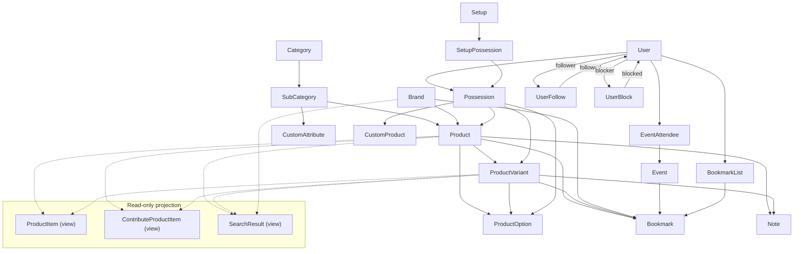

# HiFi Log

Architecture reference for the domain model, read-only SQL projections, and how the main concepts relate. Not a setup or operations guide.

## Conceptual overview

The catalog is built around **brands** and **products**. A **product** is the canonical model for a piece of gear (name, brand, categories, base specs). A **product variant** is a distinct line under that product (different finish, revision, regional model, etc.) that can override some fields while still inheriting the rest from the parent product.

**Possessions** represent a user's relationship to something in the catalog (or to a user-defined **custom product**): ownership, photos, purchase details, and optional links into **setups**. They always point at real database rows (`products`, `product_variants`, or `custom_products`), not at the unified listing abstraction.

**Product items** are not a third kind of catalog entity. They are a **read-only database view** that flattens each product and each of its variants into one row each, so lists and filters can treat "a row in the catalog" uniformly while still knowing whether that row is the base product or a variant. A second view of the same shape, **contribute product items**, adds the completeness information the contribution queues sort and filter on.

```mermaid
flowchart TB
  Category --> SubCategory
  SubCategory --> Product
  SubCategory --> CustomAttribute
  Brand --> Product
  Product --> ProductVariant
  Product --> ProductOption
  ProductVariant --> ProductOption
  User --> Possession
  Possession --> Product
  Possession --> ProductVariant
  Possession --> CustomProduct
  Possession --> ProductOption
  Product --> Bookmark
  ProductVariant --> Bookmark
  Brand --> Bookmark
  Event --> Bookmark
  User --> BookmarkList
  BookmarkList --> Bookmark
  Setup --> SetupPossession --> Possession
  Product --> Note
  ProductVariant --> Note
  User --> EventAttendee --> Event
  User -->|follower| UserFollow -->|followed| User
  User -->|blocker| UserBlock -->|blocked| User
  subgraph readonly [Read-only projection]
    ProductItem["ProductItem (view)"]
    ContributeProductItem["ContributeProductItem (view)"]
    SearchResult["SearchResult (view)"]
  end
  Product -.-> ProductItem
  ProductVariant -.-> ProductItem
  Product -.-> ContributeProductItem
  ProductVariant -.-> ContributeProductItem
  Product -.-> SearchResult
  ProductVariant -.-> SearchResult
  Brand -.-> SearchResult
```

## Taxonomy

**`Category`** and **`SubCategory`** form the gear taxonomy. Products, brands, and custom products each link to many subcategories. **`CustomAttribute`** definitions are also scoped to subcategories so structured fields only apply where relevant. Category trees are cached for navigation.

## Brand

**`Brand`** is the manufacturer or label (identity, country, lifecycle dates, description, optional logo). Brands link to subcategories and have many products. Catalog edits are versioned (see [Auditing](#auditing)).

## Product

A product belongs to one brand, has many variants, options, possessions, notes, and can be bookmarked. It links to many subcategories.

The product holds shared identity: brand, name, slug, categorization, and shared metadata. Options declared directly on the product represent product-level specs, as distinct from options declared on a specific variant.

## Product variant

A variant belongs to one product and has its own options, possessions, and notes. Where a variant doesn't override a field, it falls back to the parent product's value. Variants can also be bookmarked directly, alongside products, brands, and events.

## Catalog detail pages

**Product** and **ProductVariant** show pages share one orchestration path. For either entry type, the app loads:

- A **community image gallery** from possessions owned by users whose profiles allow catalog imagery (public always; logged-in-only when the viewer is signed in). Base-product pages use possessions with no variant; variant pages use that variant's possessions.
- **Contributors** from version history on the parent product.
- **Custom attributes** from the product (variants surface the parent's attribute set).
- When the viewer is signed in: their **possession**, **bookmark**, **note**, and **setups** scoped to that product or variant.

**`ProductCatalogShowService`** assembles this context for both show pages.

## Product option

`ProductOption` belongs to **either** a product **or** a variant (never both): structured spec lines (e.g. color, impedance). Possessions may optionally reference one to record the configuration the user actually has.

## Custom attributes (definitions vs values)

**Definitions** (`CustomAttribute`) are reusable fields tied to subcategories: label, input type, options, units, highlighted flag. Definitions are cached globally.

**Values** are stored directly on the product as a flexible set of key/value pairs, keyed by attribute label. Variants do not store their own values; wherever custom attributes are displayed for a variant, the parent product's values are shown instead.

**`CustomProduct`** does not participate in this system at all.

Filtering on catalog indexes uses the definitions applicable to the current category context.

## Catalog row views (`ProductItem`, `ContributeProductItem`)

`ProductItem` unions one row per product and one row per variant, distinguishing the two. Foreign keys elsewhere in the app still point at `Product` and `ProductVariant` directly — the view exists purely as a unified read surface, not as a new entity to relate to.

`ContributeProductItem` is a second view of the same shape, additionally carrying completeness information computed in SQL. Splitting it out keeps that extra computation off every catalog listing while letting the contribution queues sort and filter on completeness directly in the database.

Both models are read-only and share **`CatalogueProductRow`**, a concern covering brand and possession associations, list-thumbnail selection (base-product rows ignore variant-linked possessions), and image/subcategory-name preloading. `ProductItem` additionally supports name search and exposes the options that belong to each row. `ContributeProductItem` additionally exposes named gaps (missing release year, description, discontinued year, or specs) for the contribution queues to filter on, and carries its own variant-specific description so a variant lacking its own description doesn't disappear from that queue.

Use **Product** / **ProductVariant** to mutate data; use **ProductItem** for catalog listing and filters, **ContributeProductItem** for the contribution queues.

## Possession

A **user-owned instance** of catalog or custom gear, optionally tied to a `ProductOption`. Images attach to the possession. Product pages and base-product list thumbnails use possessions with no linked variant; variant surfaces use that variant's possessions.

**Setups** group possessions: `Setup` → `SetupPossession` → `Possession`. Setups are per-user, named, and may be **private** (affects public visibility and activity feed).

### Current vs previous collection

A flag separates the active collection from previous gear. Ownership spans are tracked as date ranges, and a timestamp records when an item moved from current to previous. Ownership changes drive corresponding **user activity** entries.

## Custom product

User-defined gear outside the shared catalog: categories, images, and exactly one linked **possession**. Does not use `Product`, `ProductVariant`, or `ProductItem`.

## Bookmark

Polymorphic saved reference (`Product`, `ProductVariant`, `Brand`, or `Event`)—not ownership. **`BookmarkList`** optionally groups bookmarks per user.

## Event

Dated occurrences with RSVPs via **`EventAttendee`**. Bookmarkable; included in global search projection for products/brands only, not events.

## Notes

Discussion text on a **product**, optionally scoped to a **variant** (one note per user per product/variant combination).

## Users, profiles, and dashboard

**`User`** accounts hold the collection, setups, bookmarks, notes, RSVPs, and profile media (avatar, decorative image).

**Profile visibility** (hidden, logged-in-only, visible) controls public discoverability and whether collection imagery from that user appears on catalog pages.

- **Public profile**: overview (collection preview, statistics, upcoming events, activity feed), full collection, previous gear, history, contributions.
- **Dashboard**: the signed-in owner's workspace—same domains plus a following-based activity feed, Community (following/followers), and settings pages for profile (visibility, images), notifications (follow emails, newsletter), and blocked users, alongside the Devise account form. The settings pages live under a dedicated **`Settings::`** namespace of controllers.

## Following and blocking

**`UserFollow`** is a self-referential relationship (`follower` → `followed`). Creating one records an activity for the followed user and, if they've opted in to follow notifications, sends a notification email—at most once per follower/followed pair, so follow/unfollow toggling cannot spam the inbox. Unfollowing soft-hides the activity. Users cannot follow themselves or someone who blocks them; hidden profiles are excluded from follow feeds.

**`UserBlock`** (`blocker` → `blocked`) severs follow relationships in both directions on create. Blocks are not disclosed to the blocked user: the follow button stays visible and a follow attempt fails generically.

Follow notification emails support one-click unsubscribe, backed by **`FollowNotificationUnsubscribeService`** (signed token, parallel to the newsletter flow). The unsubscribe endpoints are public, token-authenticated controllers—**`FollowNotificationUnsubscribesController`** and **`NewsletterUnsubscribesController`**—that share the **`TokenUnsubscribe`** concern, separating a non-mutating confirmation step from the actual unsubscribe, and also supporting one-click unsubscribe requests initiated by mail clients. Because recipients may not be signed in, both are exempt from the privacy-policy gate.

## Authentication and admin

**Users** authenticate for the site (registration, confirmation, lockout). **Admin users** are a separate scope for back-office catalog management (ActiveAdmin). Community members can create and edit catalog entities; admins operate the full admin interface.

## Privacy policy

Published policy text has a **version** (requires re-acceptance) and a **content revision** (text-only updates). Users store which version they accepted and when. Sign-up requires acceptance; users on an outdated version must accept again or delete their account before using the app. Static/legal pages and account recovery remain available during that gate.

## User activity

Persisted **`UserActivity`** rows capture a verb, when it occurred, the affected catalog or social item, and enough metadata to render a feed entry without re-fetching it.

**Write path:** model callbacks feed into **`UserActivities::Recorder`** (with a **`PossessionSync`** helper reconciling ownership-related verbs).

**Read path:** **`UserActivityTimeline`** builds feed rows for the public overview and the owner dashboard. The dashboard feed is following-based: it merges the owner's activities with those of followed users (hidden profiles excluded) and shows the actor per row. A dedicated feed page paginates the same timeline at the database level.

Activity is generated across most of the domain: collection changes, custom products, setups (created, and made public/private), possessions added to or removed from a setup, event attendance, profile image changes, and new follows. Some verbs are recorded for auditing but excluded from public feeds; a small subset is only ever shown on the owner's own dashboard, never on public profiles.

The timeline applies a handful of presentation rules on top of raw chronological order: respecting setup privacy, avoiding redundant entries when a later event supersedes an earlier one, and grouping contiguous similar items.

A **backfill** task can rebuild activities from existing possessions, setups, RSVPs, and attachments where historical data allows.

## Search

**`SearchResult`** is a read-only view unioning products, variants, and brands with a unified name/slug shape for global search. **`ProductItem`** powers catalog browsing and category filters—separate concern from site-wide search.

## Auditing

**PaperTrail** versions **products**, **variants**, and **brands**. Per-record changelogs and a contributions summary show who edited the catalog over time.

## Completeness and contribution queues

Most catalog entries carry little more than a name and a brand, so _incomplete_ is the normal state rather than an error. The **`Completeness`** concern (included by `Brand`, `Product`, `ProductVariant`) describes how filled-in an entry is two ways: as **named gaps** for prompts on entry pages, and as a **0–100 score** for ordering the queues. Each including model weighs its own fields, roughly in proportion to how many surfaces a field feeds rather than by feel.

Rules worth knowing:

- **Inapplicable fields don't count against the score**, so nothing is permanently capped below 100% for something nobody can fix. A brand still trading is asked for a website but not a discontinuation year, and vice versa, and the two stay comparable.
- **Highlighted custom attributes** are the app's notion of a "key spec." They're scored as one group so categories with many and few applicable attributes remain comparable. Variants inherit the parent's attributes and cannot edit them, so specs are not part of a variant's own score.

**The score is computed twice**: once for display, and once so the database can sort and filter on it directly. The two are kept in sync by a dedicated test.

### Contribution queues

**`ContributeController`** is a task board for contributors: lists of entries each missing one specific, named gap. It is read-only and excluded from search indexing—every link leads into the existing brand or product edit forms.

Queues exist for brands with no products, brands missing a specific field, and products missing a specific field. All are optionally scoped to a `Category` and ordered by **descending completeness**—the nearly finished entries first, so a contributor is handed a small, finishable job instead of a blank form.

## Cross-cutting concerns

**Service objects** orchestrate catalog filtering, catalog detail (product/variant show) pages, statistics, caching of taxonomy/counts, possession→presenter selection, newsletter and follow-notification unsubscribe, and activity recording/backfill.

**Caching** covers taxonomy menus, entity counts, custom attribute definitions, event counts, and some rendered legal or policy content.

**Attachments** (Active Storage): possession and custom-product image galleries; user avatar and decorative banner; brand logos. Purges on possessions and profile images can emit activity rows.

**App news** announcements can be dismissed per user.

**Statistics** aggregate a user's possessions (current vs previous, costs, duration, categories) for dashboard and profile summaries. In the UI this section is called **Insights**; the code keeps the statistics naming.

**Security:** rate limits on auth, catalog writes, and follow/block mutations; content security policy; bot challenge on registration and password reset.

## Presenters

Presenters sit beside models and centralize display rules for templates.

| Presenter                                                               | Wraps                                                                |
| ----------------------------------------------------------------------- | -------------------------------------------------------------------- |
| **`ItemPresenter`**                                                     | Base for gear with optional product/variant (usually via possession) |
| **`PossessionPresenter`**                                               | Current possession: prices, periods, gallery                         |
| **`PreviousPossessionPresenter`**                                       | Previous-collection possession                                       |
| **`ProductItemPresenter`**                                              | Catalog list row (paths, dates, list thumbnails)                     |
| **`BookmarkPresenter`**                                                 | Polymorphic bookmark target                                          |
| **`CustomProductPresenter`**                                            | Custom product with possession-like UI                               |
| **`SetupPossessionPresenter`**, **`CustomProduct*PossessionPresenter`** | Setup builder and related contexts                                   |
| **`ImagePresenter`**                                                    | Shared attachment presentation                                       |

**`PossessionPresenterService`** chooses among possession presenters by ownership state and custom-product linkage.

---

## Quick reference

| Concept                     | Mutable?  | Role                                                  |
| --------------------------- | --------- | ----------------------------------------------------- |
| `Category` / `SubCategory`  | Yes       | Taxonomy; scopes catalog and custom attributes        |
| `Brand`                     | Yes       | Manufacturer; products; bookmarks; search             |
| `Product`                   | Yes       | Shared catalog identity                               |
| `ProductVariant`            | Yes       | Variant-specific overrides                            |
| `ProductItem`               | No (view) | Unified catalog rows                                  |
| `ContributeProductItem`     | No (view) | Same rows plus completeness/specs, for contribute     |
| `SearchResult`              | No (view) | Global search rows                                    |
| `Possession`                | Yes       | Ownership, photos, setups; current vs previous        |
| `Setup`                     | Yes       | Named public/private gear groupings                   |
| `CustomProduct`             | Yes       | Off-catalog user gear                                 |
| `Bookmark` / `BookmarkList` | Yes       | Saved references; optional lists                      |
| `Event` / `EventAttendee`   | Yes       | Occurrences and RSVPs                                 |
| `ProductOption`             | Yes       | Spec lines on product or variant                      |
| `CustomAttribute`           | Yes       | Field definitions; values on `Product`                |
| `UserActivity`              | Yes       | Social/history feed                                   |
| `UserFollow`                | Yes       | Follower → followed relationship; drives feed & email |
| `UserBlock`                 | Yes       | Blocker → blocked; severs follows both ways           |
| `User`                      | Yes       | Account, visibility, policy acceptance, profile media |
