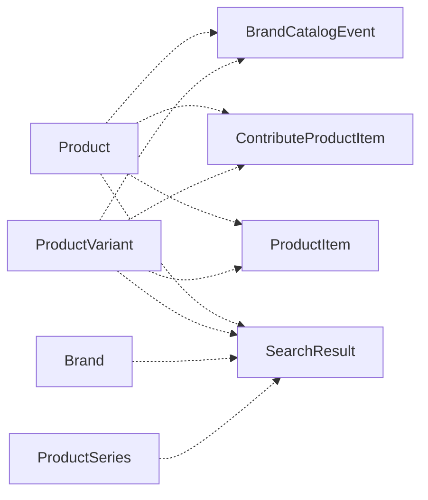

# Catalog lists and search

This document describes the read-only database views for catalog lists, the contribute queues
and the global search. It uses Simplified Technical English (ASD-STE100).

## 1. Views

The views are Scenic views. Their models are read-only.

| View                    | Use                                                                   |
| ----------------------- | --------------------------------------------------------------------- |
| `ProductItem`           | Catalog lists and filters. One row for each product and each variant. |
| `ContributeProductItem` | Contribute queues. The same rows, with completeness data.             |
| `SearchResult`          | Global search. Products, variants, brands and product series.         |
| `BrandCatalogEvent`     | Feed of followed brands. See [brand-follows.md](brand-follows.md).    |

Use **`Product`** and **`ProductVariant`** to change data. Use **`ProductItem`** for catalog lists
and filters, and **`ContributeProductItem`** for the contribute queues.

## 2. Product items (`ProductItem`)

`ProductItem` is not a third type of catalog entity. It is a union of one row for each product
and one row for each variant. Each row shows if it is a base product or a variant. Thus, lists and
filters can use one row type.

Foreign keys in the application still refer to `Product` and `ProductVariant`. The view is only a
common read surface. Do not relate other records to it.

`ProductItem` supports name search. It gives the options of each row. It also gives the series name
(`series_name`), which list rows show after the title.

## 3. Contribute product items (`ContributeProductItem`)

`ContributeProductItem` has the same shape as `ProductItem`. It also has completeness data that SQL
calculates. It is a separate view, so that catalog lists do not do this calculation. The
contribute queues can sort and filter on completeness in the database.

It gives named gaps: no release year, no description, no discontinued year, no custom attribute values. The
queues filter on these gaps. It has its own description for variants, so that a variant without a
description stays in that queue.

[Related Products](related-products.md) also reads this view, because it orders by completeness.

## 4. Shared concern (`CatalogueProductRow`)

The two views share **`CatalogueProductRow`**. This concern gives:

- The brand and possession associations.
- The selection of the list thumbnail. Base product rows ignore possessions that are linked to a
  variant.
- Preloading of images and sub category names.

## 5. Newest entries

Do not order the views by `created_at`. This builds the complete union. For a list of the newest
entries, use `CacheService.newest_product_item_refs`:

1. It takes the order from `products` and `product_variants`. The two tables have an index on
   `created_at`.
2. It caches the `[item_type, id]` pairs.
3. The caller reads the view by these identifiers.

## 6. Filters

**`ProductFilterService`** and **`BrandFilterService`** do the filtering, sorting and name search
of the catalog and brand index pages. They share `FilterableService`, `FilterConstants` and
`RelevanceOrdering`. The controller concern `FilterParamsBuilder` builds the filter parameters.

The custom attribute filters use the definitions that apply to the current category. See
[custom-attributes.md](custom-attributes.md).

## 7. Global search (`SearchResult`)

`SearchResult` is a union of products, variants, brands and product series. Each row has the same
name and slug shape. Product and variant rows have the name of their series (`series_name`). Thus,
a query with the series name finds a product, although the series is not part of the product name.

Events are not in the global search.

Global search and catalog lists are separate. `ProductItem` is for catalog lists and category
filters. `SearchResult` is for the global search.
