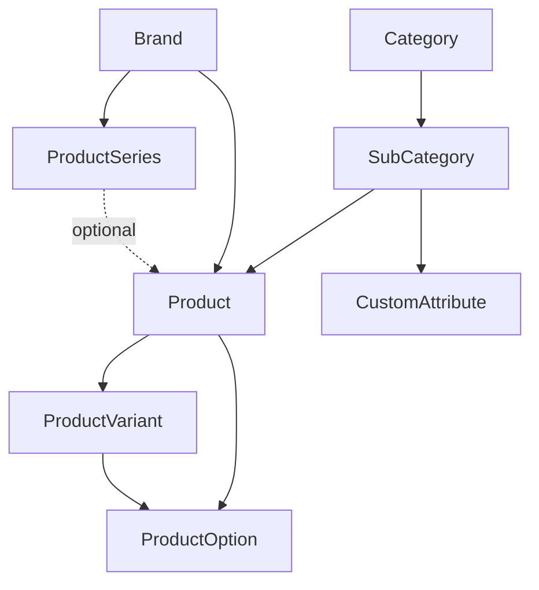

# Catalog model

This document describes the catalog entities: the taxonomy, brands, products, variants and
options. It also describes how the application assembles the product and variant pages. It uses
Simplified Technical English (ASD-STE100).

Related documents:

- Product series: [product-series.md](product-series.md)
- Custom attributes: [custom-attributes.md](custom-attributes.md)
- Catalog lists and search: [catalog-listing-and-search.md](catalog-listing-and-search.md)
- Similar Products and Similar Brands: [similar-products.md](similar-products.md)
- Related Products: [related-products.md](related-products.md)

## 1. Overview

| Model                      | Role                                                                             |
| -------------------------- | -------------------------------------------------------------------------------- |
| `Category` / `SubCategory` | Taxonomy. Scopes the catalog and the custom attributes.                          |
| `Brand`                    | The brand. Has products and series.                                              |
| `ProductSeries`            | Optional named product line of one brand.                                        |
| `Product`                  | Shared catalog identity: brand, name, slug, categories, custom attribute values. |
| `ProductVariant`           | Smaller edition of a product under the same name. Overrides some fields.         |
| `ProductOption`            | A configuration in which a product or variant is sold.                           |
| `CustomAttribute`          | Definition of a field for a value of a product. The values are on `Product`.     |

PaperTrail versions products, variants, brands and product series. Per-record changelogs and a
contributions summary show who edited the catalog.

## 2. Taxonomy

`Category` and `SubCategory` form the gear taxonomy. Products, brands and custom products each
link to many sub categories. `CustomAttribute` definitions are also scoped to sub categories, so a
custom attribute applies only where it is relevant. The application caches the category tree
for the navigation.

A sub category has a `slug` and an `identifier`:

- **`slug`** comes from `name`. FriendlyId makes a new slug when the name changes. This is
  correct for a URL.
- **`identifier`** comes from the name one time, on create. After that, it does not change.
  [Related Products](related-products.md) refers to sub categories by `identifier`. Thus, a new
  display name does not remove a pairing edge.

## 3. Brand

`Brand` is the brand or label: identity, country, lifecycle dates, description and optional
logo. A brand links to sub categories and has many products. Users can bookmark and follow a
brand (see [brand-follows.md](brand-follows.md)).

### 3.1 Three names

A brand has three names. Each name has one function:

- **`name`**: the canonical identity, written as the brand writes it ("Bang & Olufsen"). It is
  unique and it is the source of the `friendly_id` slug. JSON-LD `name` uses it. Use it when the
  brand must be identified without doubt.
- **`abbreviation`**: optional short form that is **not** part of the name ("B&O"). A
  `before_validation` clears a value that `name` already contains. Thus, the abbreviation never
  repeats the name, and the views do not need a check for repetition. The catalog views give it
  as `brand_abbreviation`, so lists do not need a join.
- **`legal_name`**: optional registered company name ("Bang & Olufsen A/S"). The brand page shows
  it in the facts list, and the brand filter can use it. Ranked search does not use it.

### 3.2 Which name is shown

- **`Brand#display_name`** gives `abbreviation` if there is one, and `name` if not. This is the
  default. Product and variant titles, product slugs, lists, breadcrumbs and navigation links use
  it.
- **`Brand#seo_name`** gives `"B&O (Bang & Olufsen)"` when there is an abbreviation, and `name` if
  not. The brand page title uses it. The `<h1>` of the brand page shows the same pair as markup.

Where there is space for the two names (rows of the brands index, brand search results, the
sitemap), the abbreviation comes first, then `name`.

### 3.3 Product slugs follow the brand name

Product titles and slugs come from `Brand#display_name`. `Product` does not see a change of the
brand columns. For this reason, `Brand` has an `after_update` that calls
`Product.resync_slugs_for` when `name` **or** `abbreviation` changes (`brand_naming_changed?`).
This gives new slugs to the products of the brand. The old slugs stay in `friendly_id_slugs`, so
an old URL gives a 301 redirect. When you add an abbreviation to a brand, all product URLs of the
brand change. This is intended, because the titles change too.

## 4. Product

A product belongs to one brand. It has many variants, options, possessions and notes. It links to
many sub categories. Users can bookmark it.

The product holds the shared identity: brand, name, slug, categories and shared metadata. It also
holds the custom attribute values (see [custom-attributes.md](custom-attributes.md)). Options
on the product apply to the product. Options on a variant apply only to that variant.

A product has zero or one series. The series has an effect on the slug and the title. See
[product-series.md](product-series.md).

## 5. Product variant

A variant belongs to one product. It has its own options, possessions and notes. When a variant
does not override a field, the value of the parent product applies. Users can bookmark a variant.

### 5.1 A variant never has different custom attribute values

A variant is a **smaller edition under the same name**: a finish, a limited edition, a regional
model number. When the measured behaviour is different (a Mk II, a second impedance), it is **a
separate product**. The design of custom attributes depends on this rule.

The rule has two results. Both are correct:

- The `product_items` view gives `products.custom_attributes` to the variant rows too. A variant
  has the custom attribute values of its parent because it cannot have other values. Thus, a filter
  on a custom attribute gives the product _and_ its variants.
- The completeness score of a variant does not include custom attributes, because a variant has no
  custom attribute values to fill in.

The application does not enforce the rule. When a contributor breaks the rule, nothing shows it.
For example, a variant for a second impedance shows the impedance of the parent and the filter
finds it with that impedance. The contribution guidelines state the rule (section 3.1 of
`/contribute/guidelines`, and first in the summary on the variant form).

A Mk II as a separate product has no link to the product that it replaced. There is no relation
between products at this time. This is the main reason why contributors want to break the rule. A
simple succession link between products can solve this problem without custom attribute values on variants.

`ProductConversionService` converts a product into a variant of another product, and back. It
never moves an entry to a different brand.

## 6. Product option

`ProductOption` belongs to **a product or a variant**, never to the two. It is one of the
configurations in which the product is _sold_: colour, finish, cable length. Each option can have
its own `model_no`. A possession can refer to one option to record the configuration that the user
has.

### 6.1 Option or custom attribute?

The answer depends on what the value describes:

- A **custom attribute** is one value that is true for _every unit_ of the product: weight,
  impedance, driver type. It describes the model. The catalog filters use it.
- A **product option** is one of many configurations in which the product is _sold_. It changes
  for each unit that a person buys and usually has its own part number. The possession records
  which option an owner has. The product does not.

Thus, the conductor material of a cable is an attribute and its length is an option. The same
cable in 1 m and 2 m is one model in two configurations. The same test puts loudspeaker finish and
cable termination on the option side.

When a brand sells the versions as different product lines, and not as configurations of one
product, use a `ProductVariant` (see [5](#5-product-variant)).

## 7. Product and variant pages

The show pages of `Product` and `ProductVariant` use the same path.
**`ProductCatalogShowService`** assembles the context for the two pages:

- A **community image gallery** from the possessions of users whose profiles allow catalog images.
  Public profiles always, profiles for signed-in users only when the viewer is signed in. A
  product page uses the possessions with no variant. A variant page uses the possessions of that
  variant.
- **Contributors** from the version history of the parent product.
- **Custom attributes** from the product. A variant shows the attributes of its parent.
- **Similar products** ([similar-products.md](similar-products.md)) and **related products**
  ([related-products.md](related-products.md)).
- **More from this series**: the other products of the series (`SeriesProducts`, see
  [product-series.md](product-series.md)).
- When the viewer is signed in: the **possession**, **bookmark**, **note** and **setups** of the
  viewer for that product or variant.

The meta block at the end of the sidebar (completeness prompt, "Edit" and "Changelog" links,
contributors) is one partial, **`shared/_entity_meta`**. The brand, product, variant and product
series pages use it. `ApplicationHelper#contributor_links` shows the contributors. For a hidden
profile, it shows the name without a link.
