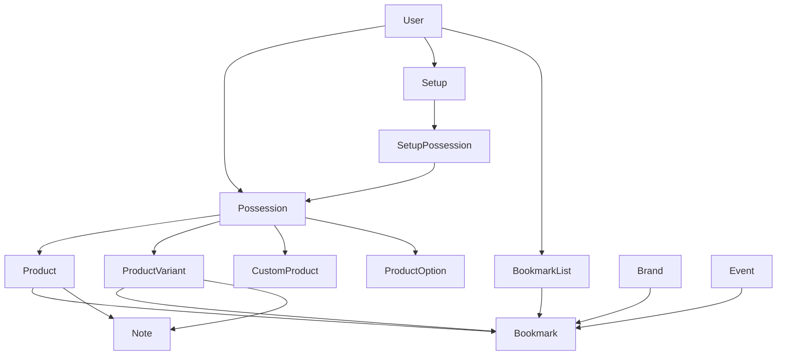

# Collection

This document describes the personal data of a user: possessions, setups, custom products,
bookmarks, notes and statistics. It uses Simplified Technical English (ASD-STE100).

## 1. Possession

A possession is an **instance of gear that a user owns** or owned. It refers to a `Product`, a
`ProductVariant` or a `CustomProduct`. It always refers to these tables, never to the `ProductItem`
view. It can refer to one `ProductOption` to record the configuration that the user has.

A possession has images, purchase details and ownership dates.

- Product pages and the list thumbnails of base products use possessions with no variant.
- Variant pages and variant rows use the possessions of that variant.
- Catalog pages show possession images only from profiles that allow it (see
  [users-and-social.md](users-and-social.md#2-profile-visibility)).

### 1.1 Current and previous collection

A flag (`prev_owned`) separates the current possessions from the previously owned possessions. The ownership periods are date ranges.
A timestamp records when an item moved from current to previous. Ownership changes make **user
activity** entries (see [user-activity.md](user-activity.md)).

## 2. Setup

A setup groups possessions: `Setup` → `SetupPossession` → `Possession`. A setup belongs to one user
and has a name. A setup can be **private**. This has an effect on the public profile and on the
activity feed.

## 3. Custom product

A custom product is gear that a user defines outside the shared catalog. It has categories, images
and exactly one linked **possession**. It does not use `Product`, `ProductVariant`, `ProductItem`
or custom attributes. The custom product form has its own help text. The catalog contribution
guidelines do not apply, because a custom product is private to one user.

## 4. Bookmark

A bookmark is a polymorphic saved reference to a `Product`, `ProductVariant`, `Brand` or `Event`.
It is not ownership. **`BookmarkList`** can group the bookmarks of a user.

A bookmark list contains only the bookmarks of its own user. The bookmark validates this. When a
user creates or changes a list, the application ignores the bookmark ids of other users. When a
user deletes a list together with its bookmarks, the application deletes only the bookmarks of
that user.

A bookmark is not a follow. For brands, see [brand-follows.md](brand-follows.md).

## 5. Note

A note is a private text of a user on a **product**. It can be limited to a **variant**. Only the
owner can see it: on the dashboard, and on the product or variant page. There is one note for each
user for each product and variant combination.

## 6. Collection state on catalog pages

**`CollectionStatusQuery`** gives the owned, previously owned and bookmarked state for a set of ids
in one query. The collection buttons on the client use it.

## 7. Statistics (Insights)

The statistics aggregate the possessions of a user: current and previous, costs, ownership
duration, categories. The dashboard and the profile show them. **`StatisticsService`** calculates
them. The UI calls this section **Insights**. The code uses the name "statistics".
