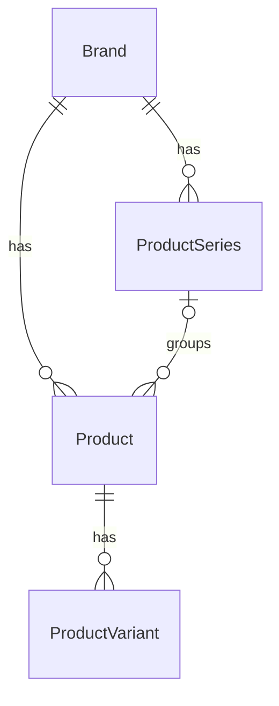

# Product series — concept

Status: implemented. Section [13](#13-implementation-notes) gives the points where the
implementation differs from the first concept.

A **product series** is a named product line of one brand, for example _Klipsch Heritage_ or
_Fezz Evolution_. A series groups products of the same brand. A series is optional: a product can
have no series.

This document records the decisions and the design. It uses Simplified Technical English
(ASD-STE100).

---

## 1. Decisions

| #   | Topic                   | Decision                                                                                                                                                                                |
| --- | ----------------------- | --------------------------------------------------------------------------------------------------------------------------------------------------------------------------------------- |
| 1   | Cardinality             | A product has **zero or one** series.                                                                                                                                                   |
| 2   | Hierarchy               | **Flat.** A series has no parent. A sub-line is a separate series.                                                                                                                      |
| 3   | Brand                   | A series belongs to **one brand**. A product can only have a series of its own brand.                                                                                                   |
| 4   | Variants                | A variant has **no series of its own**. It uses the series of its parent product.                                                                                                       |
| 5   | Categories              | A series has **no categories**. The categories come from its products. A series can span categories.                                                                                    |
| 6   | Own page                | **Yes**: `/brands/:brand_id/series/:id`. Indexable.                                                                                                                                     |
| 7   | Fields                  | `name`, `description` (Markdown), `slug`. **Years are derived** from the products.                                                                                                      |
| 8   | Product name and title  | The series is **not** part of the product name or the visible title. Name "Omega Lupi", title "Fezz Audio Omega Lupi". See [2.7](#27-product-name-title-and-slug).                      |
| 8a  | Product slug            | **Brand + series + name + model no.** when a series is set: `fezz-audio-evolution-omega-lupi`.                                                                                          |
| 8b  | Disambiguation          | The series shows as a subline under the `<h1>`, in the `<title>` element, and as a label in list rows.                                                                                  |
| 8c  | Uniqueness              | Name + model no. is unique within **brand + series**. Two "Omega Lupi" are allowed in different series.                                                                                 |
| 9   | Who can create and edit | **Any signed-in user.** Versioned with PaperTrail. Only admins delete.                                                                                                                  |
| 10  | Empty series            | An empty series **stays**. Only an admin deletes it. The delete sets the product FK to `NULL`.                                                                                          |
| 11  | Discovery               | Global search, filter on the brand products page, sitemap, JSON-LD.                                                                                                                     |
| 12  | User features           | **None.** A series can not be bookmarked or followed. A user who follows the brand already gets every new product of the series in the feed. See [10](#10-no-bookmarks-and-no-follows). |
| 14  | Similar Products        | **No change.** The series does not change the score.                                                                                                                                    |
| 15  | Default order on page   | **Release date ascending.** Unknown dates come last.                                                                                                                                    |
| 16  | ActiveAdmin             | CRUD with filters, series select on the product form, bulk-assign batch action.                                                                                                         |
| 17  | Legacy table            | Remove `product_families` and `products.product_family_id`. Create `product_series`.                                                                                                    |

### Out of scope

- A product in more than one series.
- Nested series.
- Manual order of products in a series.
- Series on custom products.
- "Complete the series" (owned / missing items on the series page).
- Insights grouped by series.
- Admin merge of two series (see [Open points](#11-open-points)).

---

## 2. Data model

### 2.1 Table `product_series`

| Column           | Type     | Notes                                                    |
| ---------------- | -------- | -------------------------------------------------------- |
| `id`             | bigint   |                                                          |
| `brand_id`       | bigint   | `NOT NULL`, FK, `ON DELETE CASCADE`                      |
| `name`           | citext   | `NOT NULL`                                               |
| `slug`           | citext   | `NOT NULL`, FriendlyId, scoped to brand                  |
| `description`    | text     | Markdown, optional                                       |
| `products_count` | integer  | `NOT NULL DEFAULT 0`. Counter cache. Base products only. |
| `created_at`     | datetime |                                                          |
| `updated_at`     | datetime |                                                          |

Indexes:

- unique `(brand_id, name)` — no duplicate series in one brand. `citext` makes it case-insensitive.
- unique `(brand_id, slug)` — the URL key.
- `name` GIN trigram — for search.

### 2.2 Column on `products`

| Column              | Type   | Notes                             |
| ------------------- | ------ | --------------------------------- |
| `product_series_id` | bigint | Nullable FK, `ON DELETE SET NULL` |

Indexes:

- `(product_series_id, release_year, release_month, release_day)` — series page and "More from
  this series" in the default order, without a sort step.
- `(brand_id, product_series_id)` — the series filter of the brand products page.

### 2.3 Naming in code

Rails treats "series" as uncountable. Thus `"series".pluralize == "series"`.

- Model: `ProductSeries`. Table: `product_series`. Association on `Product`: `belongs_to :product_series, optional: true, counter_cache: :products_count`.
  On `Brand`: `has_many :product_series, dependent: :destroy`.
- Routes: `resources :series, controller: "product_series"` nested in `brands`. Because the word is
  uncountable, the helpers are `brand_series_index_path(brand)` (index) and
  `brand_series_path(brand, series)` (show). Write this in a code comment next to the route.
- UI term: **Series** (singular and plural).

### 2.4 Validations and model rules

- `name` must be present. Strip white space.
- `name` must not start with the brand name or abbreviation. Example: "Heritage", not "Klipsch
  Heritage". Use the same check as the product name preview in the product form.
- Write the name as the manufacturer writes it. If the word "Series" is part of the official name
  (B&W "800 Series"), keep it.
- `ProductSeries#label` gives the text for running text and titles: the name plus " series", but
  only if the name does not already end with "series" (case-insensitive). "Evolution" → "Evolution
  series". "800 Series" → "800 Series". Always use `#label` for this. Do not add the word in a
  template.
- `Product#product_series` must have the same `brand_id` as the product. Validate on `Product`.
- A change of `product_series` touches the old and the new series (`touch: true`). This expires
  the series page caches.
- `ProductSeries` touches its brand. This expires the brand page caches.
- Product rules that come from the series (name, slug, uniqueness) are in
  [2.7](#27-product-name-title-and-slug).

### 2.5 Derived values

A series does not store years or a discontinued flag. The app calculates them from the products
of the series:

| Value        | Rule                                                                           |
| ------------ | ------------------------------------------------------------------------------ |
| Start year   | `MIN(release_year)` of the products.                                           |
| End year     | If all products are discontinued: `MAX(discontinued_year)`. Else: "present".   |
| Discontinued | `true` if all products are discontinued. `NULL` if the series has no products. |
| Categories   | The distinct sub categories of the products, grouped by category.              |
| Price range  | Not shown. Currencies are mixed.                                               |

Variants do not change the years. A variant is an edition of the product, not a new product in
the line.

`ProductSeries#stats` calculates these values for one series with one grouped query over the
products of the series (index `(product_series_id, release_year, …)`).

### 2.6 Legacy `product_families`

`db/schema.rb` has a table `product_families` and a column `products.product_family_id`. There is
no model, no migration and no code for them.

1. Before the migration, examine production: `SELECT COUNT(*) FROM product_families;` and
   `SELECT COUNT(*) FROM products WHERE product_family_id IS NOT NULL;`.
2. If both are 0: drop the table and the column in the same migration that creates
   `product_series`.
3. If there is data: copy it into `product_series` (`name`, `brand_id`) and
   `products.product_series_id`, then drop the legacy objects.

### 2.7 Product name, title and slug

The series is stored **one time**, on `product_series`. The product name does not contain it. Most
manufacturers do not put the series name into the model name (Klipsch "Forte IV", Fezz "Omega
Lupi"), so the visible title does not contain it either. The slug contains it, because the slug
must be unique and stable.

#### Rules

| Output                                                         | Rule                                                                            | Example                                                  |
| -------------------------------------------------------------- | ------------------------------------------------------------------------------- | -------------------------------------------------------- |
| `products.name`                                                | The model name only. No brand, no series.                                       | `Omega Lupi`                                             |
| `Product#display_name` (visible title, `<h1>`, JSON-LD `name`) | Brand `display_name` + name. **No change** to today.                            | `Fezz Audio Omega Lupi`                                  |
| `Product#qualified_name` (plain text)                          | `display_name` + ` (` + series `label` + `)`. Without a series: `display_name`. | `Fezz Audio Omega Lupi (Evolution series)`               |
| `Product#url_slug`                                             | Brand `display_name` + series name + name + model no.                           | `fezz-audio-evolution-omega-lupi`                        |
| `ProductVariant#display_name`                                  | Product `display_name` + variant name.                                          | `Fezz Audio Omega Lupi Black Edition`                    |
| `ProductVariant#qualified_name`                                | Variant `display_name` + ` (` + series `label` + `)`.                           | `Fezz Audio Omega Lupi Black Edition (Evolution series)` |

`ProductVariant#display_name` today builds the title from `product.name` itself. Change it to use
`product.display_name`, so that the title rule is in one place.

#### Where each form is used

| Place                                                                               | Form                                                                                                                                                    |
| ----------------------------------------------------------------------------------- | ------------------------------------------------------------------------------------------------------------------------------------------------------- |
| `<h1>` on product and variant pages                                                 | `display_name`, and a linked subline with the series `label` under it. Same markup pattern as the brand abbreviation (`Entity-headingSubname`).         |
| `<title>` element                                                                   | `qualified_name` + " – HiFi Log"                                                                                                                        |
| Catalog lists, brand products, search results, collections, bookmarks, setups, feed | `display_name`, and the series name as small muted text after it: "Fezz Audio Omega Lupi · Evolution". The link goes to the product, not to the series. |
| `<select>` options, ActiveAdmin, image `alt` text, emails, other plain text         | `qualified_name`                                                                                                                                        |
| JSON-LD `Product.name`                                                              | `display_name`. The breadcrumb carries the series.                                                                                                      |

Use the `<title>` **element**, not the `title` **attribute**. The attribute is only a hover tooltip.
Screen readers do not read it reliably and search engines ignore it.

Show the series label in lists **always** when a product has a series, not only when two names are
the same. A check for equal names at render time needs one more query in each list.

The Ruby rule (`qualified_name`, the list label) and the SQL views (`product_items`,
`search_results`, see [9](#9-discovery)) must give the same text. A test compares them, in the
same way as the completeness test.

#### Slug

- When a series is set, the slug **always** contains it. It is not added only on a name clash:
  then the first product would keep the short slug and the second would get the long slug, and
  the result would depend on the order of entry.
- `Product#should_generate_new_friendly_id?` also fires on a change of `product_series_id`.
- `ProductSeries` gets an `after_update` that calls `Product.resync_slugs_for` on its products
  when `name` changes. Use the same code path as for brand renames (keep the old slug in
  `friendly_id_slugs` for a 301).
- Consequence: assign, change or remove the series of a product, or rename a series, and the
  product URL changes. The old URL redirects with 301. Possessions, bookmarks and notes use ids,
  so they do not change.

#### Validations on `Product`

- `name` must not start or end with the name of its series (case-insensitive, word boundary).
  Error: "Do not add the series name to the product name. The series is shown separately." This
  keeps the data clean.
- `name` + `model_no` is unique within `brand_id` + `product_series_id` (`NULL` series counts as
  one group). Add a unique index:
  `(brand_id, COALESCE(product_series_id, 0), lower(name), COALESCE(model_no, ''))`.
  Before the index, find and fix the existing duplicates (see
  [2.8](#28-existing-data)).
- Two products with the same name in two series are now valid. Their slugs are different because
  of the series. FriendlyId does not need its UUID fallback for them.

#### Product form

- The title preview (`data-product-title-preview`) shows `display_name` and, when a series is
  selected, the series label under it.
- When the name starts or ends with the selected series name, show the warning from the
  validation at once, next to the existing "brand name typed twice" warning.
- When the brand has a product with the same name in the same series (or both without series),
  show "A product with this name already exists" with a link. Use the brand duplicate warning as
  the model.

### 2.8 Existing data

Some products have the series name in the product name, for example "Evolution Omega Lupi" and
"Legacy Omega Lupi" of Fezz Audio, with the slug `fezz-audio-evolution-omega-lupi`. Migration for
each such product:

1. Create the series ("Evolution") if it does not exist.
2. Remove the series name from the product name ("Omega Lupi").
3. Assign the series.

The new slug is brand + series + name = `fezz-audio-evolution-omega-lupi`. This is the same as the
old slug, so these products need no redirect. The visible title changes from "Fezz Audio Evolution
Omega Lupi" to "Fezz Audio Omega Lupi" with the subline "Evolution series".

Find the candidates with a rake task, `series:candidates`. It does not change data. It lists, per
brand, the first word of product names that two or more products of the brand share, with the
products. An admin examines the list and applies the migration in ActiveAdmin or with a second
task, `series:apply[brand_slug,series_name]`. Do not apply it automatically: names can contain a word that is not a series (for
example a model name that starts with "Reference").

Before step 3, examine if the word is really a series. If the manufacturer used the word only
later to tell a new version from an old one (for example "Legacy" for the first Omega Lupi), it
is not a product line. Then keep two separate products and do not create a series for one product.

Also run a check for products that have the same brand, name and model no. (without series) before
the unique index of [2.7](#27-product-name-title-and-slug) is added.

---

## 3. Series page

URL: `/brands/:brand_id/series/:id`, for example `/brands/klipsch/series/heritage`.

Controller: `ProductSeriesController#show`, `#new`, `#create`, `#edit`, `#update`, `#changelog`,
`#assignable_products`, `#assign_products`. The series page also assigns products (see
[7.3](#73-assign-products-on-the-series-page)).

Lookup: `FriendlyFinder` scoped to the brand. An old slug returns a 301 to the new slug. A slug
of a different brand returns 404.

### 3.1 Layout

Use the `shared/index_page` layout, as on `brands#products`:

- **Header:** `<h1>` "Klipsch Heritage". Brand name as `display_name`, then the series name.
  Small label "Series" above the heading.
- **Sidebar (`product_series/_data`):**
  - Brand (link).
  - Years: "1946 – present" or "2015 – 2021" (derived).
  - Status: discontinued / in production (derived).
  - Number of products.
  - Categories (links to the brand products page, filtered by the category and the series).
  - Description (Markdown, `formatted_description`).
  - Meta links: Edit, "Add / remove products" (a button that looks like a link and opens the
    dialog of [7.3](#73-assign-products-on-the-series-page); for signed-out visitors a link to
    sign-in), Changelog. Contributors list.
- **Main area:** product table (`shared/products_table`, `hide_brand: true`) of the series.
  Includes variants, as `product_items` rows. Paginated.
- **Filter:** the same filter partial as `brands#products`, with categories limited to the
  sub categories of the series.
- **Sort:** release date ascending (default), release date descending, name A–Z, name Z–A.

On viewports narrower than 48rem, hide the sidebar details and show only the headline, as on
the other index pages.

### 3.2 Empty series

Show an empty state: "No products have been added to this series yet." With "add products of the
brand to this series" (opens the dialog of [7.3](#73-assign-products-on-the-series-page); for
signed-out visitors a link to sign-in) and "Add a new product" (product form with brand and series
preselected).

### 3.3 SEO

- `<title>`: brand `display_name` + series `label` + " – HiFi Log", for example "Klipsch Heritage series – HiFi Log".
- Meta description: first sentence of the description, else "All products of the Klipsch Heritage
  series: speakers, amplifiers …" from the derived categories.
- Index the page when it has at least one product. Set `noindex, follow` when it is empty.
- JSON-LD:
  - `BreadcrumbList`: Brands › Klipsch › Heritage.
  - `ItemList` of the products on the current page (same helper shape as
    `brand_products_item_list_json_ld`).
- Sitemap: one entry per series with products. `lastmod` = `product_series.updated_at`.
  Load with `ProductSeries.where("products_count > 0").select(:id, :slug, :brand_id, :updated_at).find_each`.
- `changelog`, `edit`, `new`: `noindex`.

---

## 4. Brand page and brand products page

### 4.1 Brand page (`brands#show`)

- The series of the brand as a line of links, ordered by name.
- In the "Products" section, after the category list: the 8 newest base products of the brand
  (`BrandLatestProducts.products`, `PRODUCTS_LIMIT`).
- A section **"Product series"** between "Products" and "Similar Brands", in the same layout as
  "Related Products" on product pages: for each series with products, a heading that links to the
  series page and a list of the 4 newest base products of the series
  (`BrandLatestProducts.by_series`, `SERIES_LIMIT`). Series without products are not shown. The section is not
  shown when no series of the brand has products.
- The lists show at most 8 (brand) or 4 (series) entries (partial `shared/_products_preview`). A
  "view all" link next to the section heading, to the brand products page (or the series page),
  covers the rest.
- "Newest" in both lists is `Product::NEWEST_FIRST_ORDER_SQL`: newest release date first (a date
  with only a year comes after the dates with a month in the same year); products without a
  release date come after them, the most recently added first.
- If the brand has no series, the meta links of the sidebar show "Add series", so that
  contributors can find it.

**Performance:** `BrandsController#show` loads only `id`, `name`, `slug` and `products_count` of the
series (`@brand.product_series.order(:name)`, served by the unique index `(brand_id, name)`).
`BrandLatestProducts.products` reads the first 8 rows of the index
`index_products_on_brand_newest_first` (`brand_id` + the "newest" order), so it does not sort the
products of the brand. `BrandLatestProducts.by_series` gets the product ids of all series in one
query: a `LATERAL` subquery per series reads the products of that series (index on
`product_series_id`) and keeps the newest 4. The work depends on the size of the brand's series,
not on the size of the catalog. The ids of both lists are cached per brand
(`brand.cache_key_with_version`; a product change touches the brand), and the `product_items` rows
are loaded with their thumbnails by `ProductItem.base_products_in_order`.

The first concept had a "Series" section with years, product counts and categories per series. It
was replaced by this section before release, so the brand page needs no grouped query over the
products.

### 4.2 Brand products page (`brands#products`)

- Add a **"Series" select** to the filter sidebar. Options: all series of the brand with products,
  plus "No series". The select is not shown if the brand has no series.
- Parameter: `series=<slug>` or `series=none`.
- `ProductFilterService` filters on `product_items.product_series_id`.
- The series page is the canonical URL for a "series only" list. If only `series` is set and no
  other filter, the brand products page sets `<link rel="canonical">` to the series page.

---

## 5. Product and variant pages

### 5.1 Facts and breadcrumb

- Under the `<h1>`, show the series `label` as a linked subline (see
  [2.7](#27-product-name-title-and-slug)). The `<title>` element uses `qualified_name`.
- Add a row **"Series"** to `products/_data` with a link to the series page. Do not show the row if
  the product has no series.
- Variant pages show the series of the parent product.
- Breadcrumb (visible and JSON-LD): Brands › Klipsch › Heritage › Forte IV. Without a series:
  Brands › Klipsch › Forte IV.
- `Product` JSON-LD: no change. Schema.org has no good type for a product line, so the
  breadcrumb carries the relation.

### 5.2 "More from this series"

A new block on product and variant pages. Position: above "Similar Products".

- Shows base products of the same series, not the product itself. Variants are not shown.
- Order: release date ascending, unknown dates last, then id.
- Size: `RelatedProducts::Query::PER_GROUP` items, the same as the other blocks.
- "View all" link to the series page when the series has more products than the block shows.
- The block is not shown if the product has no series or the series has only this product.
- Uses the same list layout and partial as "Similar Products".

**Performance:** one query with `WHERE product_series_id = ? AND id <> ? ORDER BY release_year,
release_month, release_day, id LIMIT n`. The index from [2.2](#22-column-on-products) serves it.
`ProductCatalogShowService` loads the block with the other blocks. Cache the ids per series
(`series.cache_key_with_version`); a product change touches the series.

### 5.3 Similar and related products

No change. The series does not change the score or the candidates of Similar Products or Related
Products. [similar-products.md](similar-products.md#12-candidates) states that the block does not
remove products of the same series.

---

## 6. Create and edit series (site)

All write actions need a signed-in user. They set `set_paper_trail_whodunnit`. Rack::Attack
throttles them with the existing catalog write throttle.

### 6.1 Create from the brand page

`/brands/:brand_id/series/new`. Form fields:

- Brand (read-only).
- Name. Placeholder: "e.g. Heritage". Live preview "Klipsch Heritage", as the product name preview.
  Warning if the name starts with the brand name.
- Description (optional, Markdown help as in the product form).
- Optional: "Select the products of the series after saving" → after save, redirect to the series
  page with the dialog open (`#assign-products`).

Guidelines box (`
`), in the same style as the product guidelines:

- A series is a product line that the manufacturer names, for example "Heritage" or "Evolution".
- Do not add the brand name.
- Write the name as the manufacturer writes it.
- Do not create a series for a single product with versions (Mk I, Mk II). Use separate products.
- Do not create a series for a category ("Klipsch speakers").

After a create with a name that already exists for the brand: do not create a duplicate. Show the
validation error with a link to the existing series.

### 6.2 Edit

`/brands/:brand_id/series/:id/edit`. Fields: name, description. The brand cannot change. The
products are not on this page (see [7.3](#73-assign-products-on-the-series-page)).
A name change regenerates the slug. FriendlyId keeps the old slug for a 301.

### 6.3 Changelog and contributors

- `has_paper_trail` on `ProductSeries`.
- `/brands/:brand_id/series/:id/changelog` renders `shared/_changelog`.
- Contributors on the series page: users with versions on the series record.
- Product changelogs show `product_series_id` changes. The changelog formatter must show the
  series **name**, not the id, for this attribute (same as it must do for `brand_id`).

### 6.4 Delete

Not possible on the site. Only admins delete (see [8](#8-activeadmin)).

---

## 7. Assign a series to a product

### 7.1 Product form (new and edit)

Add a field **"Series (optional)"** below the brand field in `products/_form`.

Control: a combobox (text input + list), in the same style as the brand search.

1. The list loads the series of the selected brand:
   `GET /brands/:brand_id/series.json` → `[{ id, name }]`. Small and cacheable. The brand has few
   series, so load all of them. No server search is necessary.
2. The user can select a series, or clear the field (no series).
3. If the typed text does not match a series, the last list item is
   **"Create new series "<text>""**. When selected, the form sends the name, not an id.
4. When the brand changes in the form (new product), clear the series field and load the list of
   the new brand.
5. When the user creates a **new brand** inline, the list is empty. The user can only create a
   new series.
6. Without JavaScript: a plain `<select>` with the series of the brand plus a text field
   "New series name". The select is not available when the brand is new.

Parameters:

- `product[product_series_id]` — an existing series. Empty string = no series.
- `product[new_product_series_name]` — a new series. Takes priority when present.

Server side (`ProductsController#create` / `#update`, in one transaction):

- If `new_product_series_name` is present: `brand.product_series.find_or_create_by!(name:)`. The
  `citext` unique index makes this safe against duplicates in a different case. Retry once on
  `ActiveRecord::RecordNotUnique`.
- Validate that the series belongs to the brand of the product (model validation, see
  [2.4](#24-validations-and-model-rules)). A forged id of a different brand fails.

Preselect: `new_product_path(brand_id:, series: <slug>)` preselects the series. Use it on the
series page ("Add a new product") and on the empty state.

Guideline in the product form: "If the product is part of a named product line (for example
Klipsch Heritage), select the series. This is optional."

### 7.2 Variant form

Show the series of the parent product as read-only text: "Series: Heritage (from the product)".
No input.

### 7.3 Assign products on the series page

The series page (`/brands/:brand_id/series/:id`) has a button "Add / remove products" between
"Edit" and "Changelog" in the meta links. It looks like a link and opens a dialog
(`shared/_entity_picker_dialog`, the same component as the product dialog of a setup). Only
signed-in users get the button and the dialog; signed-out visitors get a link to sign-in that
returns to `#assign-products`, and that hash opens the dialog. There is no separate page for this.

The dialog has a form of its own (`PATCH /brands/:brand_id/series/:series_id/products`,
`ProductSeriesController#assign_products`). It changes only the products, not the name or the
description of the series. The dialog is rendered outside the sidebar, so that it also opens on
narrow viewports, where the sidebar details are hidden.

- The dialog shows **all** products of the brand, with a checkbox each. Checked = the product is
  in this series. There is no pagination.
- The rows load the first time the dialog opens: `GET
/brands/:brand_id/series/:series_id/products` (`ProductSeriesController#assignable_products`)
  answers the rows without a layout, and the browser puts them in the list. The series page itself
  carries no rows, so it stays small for the visitors who do not open the dialog.
- The order is the products of this series first, then by name. It is the order of the load, so a
  row does not move when the user removes its check.
- A field above the list filters the rows **in the browser**. A hidden row keeps its checkbox, so
  the filter never changes the selection. There is no search on the server.
- A product in a **different** series shows "now in the <Series>". If the user checks it, the
  product moves to this series.
- A hidden field `products_loaded=1` comes with the rows, and each row has a hidden
  `product_ids[]`. The submit describes the membership of the loaded rows: a listed product that
  is not checked is not in the series. A product that is not listed does not change, so a product
  that joined the series after the dialog loaded (for example through the product form) stays in
  it. Without `products_loaded` (the user did not open the dialog) the submit changes no product.
- Each changed product is saved on its own, so that each change is a PaperTrail version with
  `whodunnit`.
- Limit: max. 500 product changes per submit (Rack::Attack + a server check). A submit with more
  changes changes nothing and returns to the series page with an alert. A `GET` of the rows is
  limited to 60 per minute per IP.
- After the submit the series page shows the number of changed products, and one line per product
  that did not change.

**`ProductSeriesAssignment`** does the work of one submit. Two rules keep a submit usable:

- **The end state decides, not the order of the saves.** The service looks for a name clash in the
  state the submit would produce, before it writes the first row, and then skips the per-row
  uniqueness check of the product name (`Product#skip_name_uniqueness`). Without this, a set of
  changes with a valid end state could fail in the middle: two products with the same name that
  change places between two series are in the same group for as long as the first save is written.
- **A product that can not change is left as it is.** The other products of the submit still
  change, and the series page then reports one line per product that did not change:
  - a name clash names the other product, links to it and says where it is ("with no series", "in
    the Legacy series") and how to solve it (a model number, or a series for the other product);
  - another invalid product shows its own error messages.

Only invalid attributes of the series itself stop the whole submit; the form then shows the errors
with the checkboxes as the user left them.

### 7.4 Other flows that change the brand or the product type

| Flow                                                      | Rule                                                                                                        |
| --------------------------------------------------------- | ----------------------------------------------------------------------------------------------------------- |
| Admin changes `brand_id` of a product                     | Clear `product_series_id` if the series is of the old brand. Show a notice.                                 |
| `ProductConversionService.to_variant` (product → variant) | The product disappears. The variant uses the series of its new parent. Nothing to copy.                     |
| `ProductConversionService.to_product` (variant → product) | The new product gets the series of the old parent. The brand is the same, so this is valid.                 |
| Brand is deleted                                          | `dependent: :destroy` on the series. The products are deleted with the brand already.                       |
| Product is deleted                                        | The counter cache decreases. The series stays.                                                              |
| Series of a product is set, changed or removed            | The product slug changes. The old slug redirects (301). Variant slugs are nested, so they follow.           |
| Series is renamed                                         | `Product.resync_slugs_for` on the products of the series (see [2.7](#27-product-name-title-and-slug)).      |
| Series is deleted (admin)                                 | FK is set to `NULL`, so the slugs lose the series. Resync the slugs of the former products in the same job. |

---

## 8. ActiveAdmin

### 8.1 Resource `ProductSeries`

`app/admin/product_series.rb`:

- `menu priority` next to Products, label "Series".
- `permit_params :brand_id, :name, :description`.
- **Index:** id, name, brand (link), `products_count`, created_at. Links to the public page.
- **Filters:** brand (select with search), name, `products_count` (range), created_at.
  Remove the filters for `products`, `versions`, `slugs`, `bookmarks`.
- **Show:** attributes, list of products (link to admin product), PaperTrail versions, link to the
  public page.
- **Form:** brand (select, only on create), name, description.
- **Delete:** allowed. The FK sets `products.product_series_id` to `NULL`. Show the number of
  products in the confirmation text.

### 8.2 Product and variant resources

- Product form: add `f.input :product_series`, as a select grouped by brand or, better, filtered
  by the selected brand. Keep it simple: `collection: ProductSeries.where(brand_id: f.object.brand_id)`
  on edit; on new, show it only after the brand is saved.
- Add `:product_series_id` to `permit_params`.
- Product index: add a filter "Series" and a column "Series".
- Product show: add the series row.
- Variant show: show the series of the parent (read-only).

### 8.3 Batch action "Assign to series"

On the products index:

- `batch_action :assign_to_series, form: -> { { series: ProductSeries.order(:name).pluck(:name, :id) } }`.
- Before the update, check that all selected products have the brand of the series. If not, stop
  and show which products do not match. Do not assign some of them.
- Add a second batch action "Remove from series".
- Each product update creates a PaperTrail version. `whodunnit` is the admin user.

With many series, a single select of all series is too long. Filter the product index by brand
first; the form then lists only the series of that brand (read the `q[brand_id_eq]` param).

---

## 9. Discovery

### 9.1 `product_items` view (new version)

Add `products.product_series_id` and `product_series.name AS series_name` to both halves of the
union (`LEFT JOIN product_series` on the primary key). Variants project the values of the parent,
as they already do for `brand_id`. This makes the brand products filter and the series page one
indexed condition on the view, and gives the list rows their series label without a query per
row.

`contribute_product_items` does not need the column.

### 9.2 Global search (`search_results` view, new version)

- Add a fourth union part for series, `item_type = 'ProductSeries'`.
- Add a column `series_name`. Product and variant rows carry the series name of the product.
  Brand rows have `NULL`. Series rows use `brand_name`, `brand_abbreviation`, `brand_slug` and a
  new `series_slug`.
- Because product rows have `series_name`, "evolution omega lupi" finds the product, although the
  series is not in the product name. Result rows show the series label as in the other lists.
- Add `series_name` to the `pg_search` `against:` list, as the brand name is.
  "klipsch heritage" matches brand + series. "heritage" matches the series.
- Result row text: "Klipsch Heritage" with a small label "Series" and the number of products.
- Rank: series rows rank with brands, above products with the same name score.
- Row cardinality: + one row per series. Small compared to products.

### 9.3 Home page and contribute

- Home page: no change.
- Contribute queues: no queue for series in the first version. A series is optional, so "product
  without series" is not a gap.
- Completeness: the series is **not** part of the completeness score of a product.

---

## 10. No bookmarks and no follows

A series can not be bookmarked or followed. The first concept had both; they were removed before
release.

- A user who follows the brand already gets every new product of the brand, and so of each of its
  series, in the dashboard feed. A series follow would only add a second way to the same entries,
  plus a view, a feed source and a deduplication step between the two.
- A bookmark saves a thing to come back to. The series page is one click from every product in
  the series and from the brand page, so it is easy to find again.
- Thus there is no `series_follows` table, no `SeriesCatalogEvent` view, no
  `products.series_assigned_at` column (it only fed the follow feed), and `Bookmark` accepts the
  same item types as before.

---

## 11. Open points

These points are not decided. The recommended default is in bold.

1. **Merge two series (admin).** Duplicates ("Heritage" / "Heritage Series") will occur. Without a
   merge action an admin must bulk-assign and delete. **Add a merge member action in a later
   version** if duplicates become frequent. A merge moves the products and keeps the old slug for a 301.
2. **Series completeness.** A contribute queue "series without description". **Not in the first
   version.**
3. **Insights by series** and **"Complete the series".** Possible later, because the data model
   supports them without change.
4. **Series without products on the brand page.** Shown in the list of links, so contributors
   can fill them. **Keep them visible.**

---

## 12. Implementation order

1. Migration: `product_series`, `products.product_series_id`,
   indexes, drop the legacy `product_families` objects (after the check in [2.6](#26-legacy-product_families)).
   Model `ProductSeries`, associations, validations, PaperTrail, counter cache.
   `Product#qualified_name`, slug rule, slug resync, `ProductSeries#label`.
   Rake task `series:candidates`; fix existing data ([2.8](#28-existing-data)); then add the
   unique index for name + model no. within brand + series.
2. ActiveAdmin resource, product form input, batch actions. This allows admins to seed data early.
3. `product_items` view version with `product_series_id` and `series_name`. Series label in list rows.
4. Series page (show, new, edit, changelog), routes, sitemap, JSON-LD.
5. Series links on the brand page, brand products filter.
6. Product form combobox, JSON endpoint, variant read-only field, conversion service rules.
7. Product page facts row, breadcrumb, "More from this series".
8. Product dialog on the series page.
9. `search_results` view version.
10. Documentation: add the product series to the README terms and diagram, and to
    [catalog-model.md](catalog-model.md). State in [similar-products.md](similar-products.md)
    that the series does not change the candidates.

### Tests

- Model: brand match validation, name validation, counter cache.
- Naming: product name with the series name at start or end fails. Two "Omega Lupi" in two series
  are valid and get different slugs without a UUID. `ProductSeries#label` does not give
  "800 Series series".
- Slugs: set, change and remove a series, and rename a series; the old slug redirects (301).
  The migration of "Evolution Omega Lupi" keeps the slug.
- Title: `qualified_name` in Ruby and the series label from `product_items` / `search_results`
  give the same text.
- Request: create with an existing name in a different case does not create a duplicate. A
  forged series id of a different brand fails.
- Admin: batch assign refuses mixed brands. Brand change clears the series.
- Conversion: `to_product` copies the series.
- Views: `product_items` projects the parent series onto variants.
- Performance: the series query of the brand page and the "More from this series" query use an index
  (`EXPLAIN` in a test, or a check on a seeded database).

---

## 13. Implementation notes

The implementation follows this concept, with these differences:

| Topic                                   | Implementation                                                                                                                                                                                                                                                                              |
| --------------------------------------- | ------------------------------------------------------------------------------------------------------------------------------------------------------------------------------------------------------------------------------------------------------------------------------------------- |
| Product breadcrumb (5.1)                | No change. The product breadcrumb stays Products › Category › Sub category › Product, as before. The series page has its own breadcrumb: Brands › Brand › Series.                                                                                                                           |
| Unique index for name + model no. (2.7) | Not added. The rule is a model validation that runs only when name, model no., series or brand change. Run `bin/rails series:duplicates` to find old duplicates; add the index when the list is empty.                                                                                      |
| Series field in the product form (7.1)  | A text input with a `<datalist>` of the series of the brand. No custom combobox is necessary: the browser shows the list, and a typed name creates a new series. `entity_form.js` loads the list when the brand changes and shows a warning when the product name contains the series name. |
| Live preview in the series form (6.1)   | Not added. The server validation refuses a name that starts with the brand name.                                                                                                                                                                                                            |
| Admin merge (11)                        | Not added.                                                                                                                                                                                                                                                                                  |
| Bookmarks and follows (10)              | Removed before release. See [10](#10-no-bookmarks-and-no-follows).                                                                                                                                                                                                                          |

### Files

- Migrations: `db/migrate/20260921130000_create_product_series.rb` (tables, columns, indexes, legacy
  `product_families`) and `db/migrate/20260921130100_update_views_for_product_series.rb`
  (`product_items` v23, `contribute_product_items` v05, `search_results` v08).
- Models: `ProductSeries`; changes in `Product`, `ProductVariant`, `Brand`, `ProductItem`,
  `SearchResult`.
- Controllers: `ProductSeriesController`; changes in `BrandsController`, `ProductsController`,
  `ProductVariantsController`, `SearchController`.
- Services: `SeriesProducts`; changes in `ProductFilterService` (`series:`),
  `ProductCatalogShowService`, `ProductConversionService`, `SitemapBuilder`.
- Admin: `app/admin/product_series.rb`; series input, column, filter and batch actions in
  `app/admin/products.rb`.
- Rake tasks: `lib/tasks/product_series.rake` (`series:candidates`, `series:apply`,
  `series:duplicates`, `series:resync_slugs`).

### Deploy steps

1. `bin/rails db:migrate`. The migration prints a message if it copied rows from
   `product_families`; then run `bin/rails series:resync_slugs`.
2. `bin/rails series:candidates` and examine the list.
3. For each real series: `bin/rails "series:apply[brand-slug,Series Name]"` (dry run), then the
   same with `,run`.
4. `bin/rails series:duplicates`.
