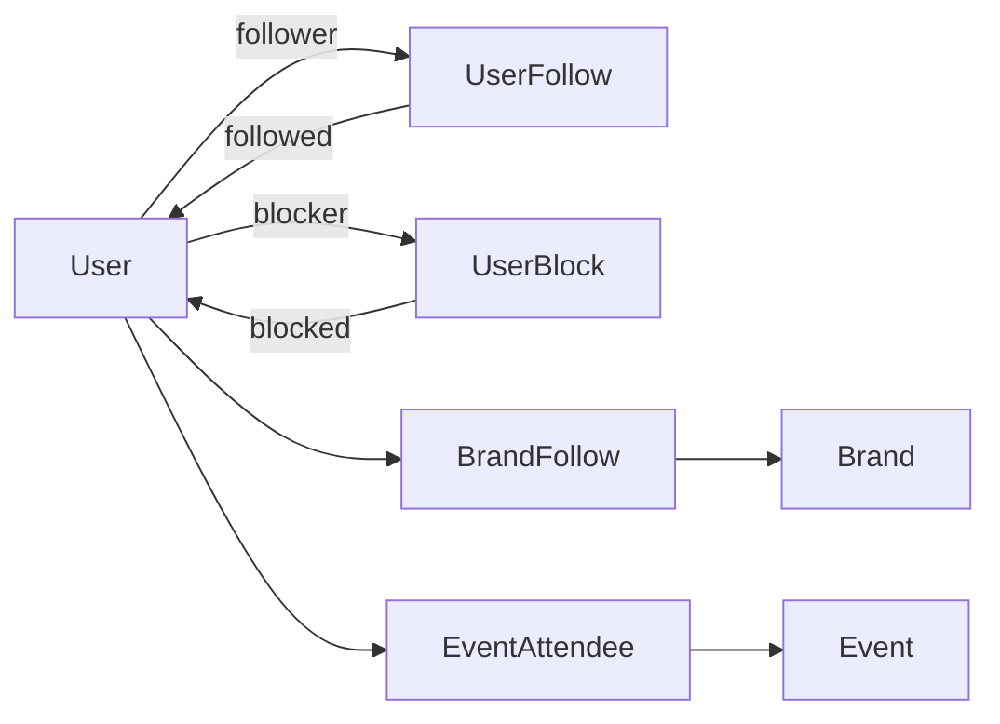

# Users, profiles and social features

This document describes users, profile visibility, the dashboard, events, following and blocking.
It uses Simplified Technical English (ASD-STE100).

Related documents:

- Following brands: [brand-follows.md](brand-follows.md)
- Activity feed: [user-activity.md](user-activity.md)
- Authentication, privacy policy and security: [privacy-auth-security.md](privacy-auth-security.md)

## 1. User

A **`User`** account holds the collection, setups, bookmarks, notes, RSVPs and profile media
(avatar and decorative image). Active Storage stores the profile media.

## 2. Profile visibility

A profile has one of three visibility values:

| Value            | Who can see the profile |
| ---------------- | ----------------------- |
| `visible`        | Everybody               |
| `logged_in_only` | Signed-in users only    |
| `hidden`         | Nobody except the owner |

The visibility also controls if catalog pages show the collection images of the user. The
controller concern `ProfileVisibility` (`find_viewable_user!`) applies the rule to one user.
`User.listable_for` applies the same rule to a set of users: confirmed accounts only, `visible`
always, `logged_in_only` for signed-in viewers, `hidden` never.

## 3. Public profile and dashboard

The **public profile** has these pages: overview (collection preview, statistics, upcoming events,
activity feed, collection brands), full collection, previously owned possessions, history, contributions and
brands.

The **Brands** section of the profile and the `users#brands` page show the brands of the _current
collection_ of the owner. They do not show the brands that the owner follows.

- On the overview, it is a grid of eight logo tiles, ordered by the number of items of each brand.
  When there are more than eight brands, it shows seven tiles and a `+N` tile.
- The page lists the brands from A to Z.

The **dashboard** is the workspace of the signed-in owner. It has the same areas and also:

- An activity feed from the followed users and brands.
- Community: following, followers and brands.
- Settings pages for the profile (visibility, images), notifications (follow emails, newsletter)
  and blocked users, next to the Devise account form.

The profile and notification settings are in the **`Settings::`** controller namespace. The blocked
users page has its own top-level controller.

## 4. Events

An event is a dated occurrence. Users send an RSVP through **`EventAttendee`**. Users can bookmark
an event. The controller concern `EventListing` holds the shared list behaviour. Events are not in
the global search.

## 5. Following users

**`UserFollow`** is a self-referential relation (`follower` → `followed`).

- A new follow records an activity for the followed user.
- When the followed user accepted follow notifications, a new follow sends an email. The
  application sends a maximum of one email for each follower and followed pair. Thus, a user cannot
  send many emails with follow and unfollow.
- An unfollow hides the activity.
- Users cannot follow themselves or a user who blocks them.
- Follow feeds do not include hidden profiles.

## 6. Blocking users

**`UserBlock`** (`blocker` → `blocked`) removes the follow relations in the two directions when it
is created.

The blocked user does not see the block. The follow button stays visible, and a follow attempt
fails with a general message.

`UserBlock` does not hide public pages. It removes follows and filters feeds only. The follower
list of a brand does not apply it.

## 7. Unsubscribe from emails

Follow notification emails and the newsletter have a one-click unsubscribe with a signed token:

- **`FollowNotificationUnsubscribeService`** and **`NewsletterUnsubscribeService`** create and read
  the tokens.
- **`FollowNotificationUnsubscribesController`** and **`NewsletterUnsubscribesController`** are
  public controllers with token authentication. They share the **`TokenUnsubscribe`** concern.
- The concern separates a confirmation step, which changes nothing, from the unsubscribe. It also
  accepts one-click unsubscribe requests from mail clients.
- The recipient is possibly not signed in. Thus, the two controllers do not use the privacy policy
  gate.

## 8. Newsletter and app news

Admins write **newsletter** issues in ActiveAdmin. The application sends them to users who accepted
the newsletter. There is a test-send function. The unsubscribe flow is in
[7](#7-unsubscribe-from-emails).

**App news** (`AppNews`) are announcements. Each user can close an announcement. A join to `User`
records this.
